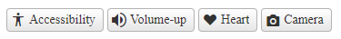
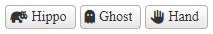
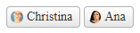

# Customization

The ChipList component provides options for customizing its look and feel.

- [Custom Icons](#custom-icons)
- [Display Avatars](#display-avatars)

## Custom Icons



The ChipList already implements a large set of icons by default (see [List of Font Icons](https://docs.telerik.com/kendo-ui/styles-and-layout/sass-themes/font-icons#list-of-font-icons)), but you can supply your own icons if you want. You can create the icons or use 3rd party Icon libraries such as Font Awesome.

### Create your custom icon CSS class

Telerik Assemblies load an icon font that contains a large set of icons. To use these icons, you will need to create CSS classes that point to the icon by their `Unicode`.

To create an icon class with the icons from the Telerik embedded fonts, you will need to:

- Create a Custom CSS class and set the `font-size`, `font-family` properties. This will style the font itself.
- Create other CSS class names and set the `content` property of the `::before` pseudo selector. This points to the icon in the library by their unicode.
- Point the `IconClass` property of the **ChipListItem** to the newly created CSS icon class

For the sake of demonstration, we used the `accessibility`, `volume-up`, `heart`, and `camera` icons from the **WebComponentsIcons** library (see [List of Font Icons](https://docs.telerik.com/kendo-ui/styles-and-layout/sass-themes/font-icons#list-of-font-icons)).

Example

````ASP.NET
<style>
    .my-icon {
        font-family: "WebComponentsIcons";
        font-size: 16px;
    }

    .accessibility::before {
        content: "\e14f";
    }
    .volume-up::before {
        content: "\e206";
    }
    .heart::before {
        content: "\e301";
    }
    .camera::before {
        content: "\e500";
    }
</style>

<telerik:RadChipList ID="RadChipList1" runat="server">
    <Items>
        <telerik:ChipListItem runat="server" IconClass="my-icon accessibility" Label="Accessibility"></telerik:ChipListItem>
        <telerik:ChipListItem runat="server" IconClass="my-icon volume-up" Label="Volume-up"></telerik:ChipListItem>
        <telerik:ChipListItem runat="server" IconClass="my-icon heart" Label="Heart"></telerik:ChipListItem>
        <telerik:ChipListItem runat="server" IconClass="my-icon camera" Label="Camera"></telerik:ChipListItem>
    </Items>
</telerik:RadChipList>
````

In case you have your own icons, you can import/load the Icon library and use that Font instead.

````CSS
 @font-face {
    font-family: "Your Icon Font Library";
    src: url(url_to_the_icon/YourIconFontLibrary.woff);
}

.my-icon {
    font-family: "Your Icon Font Library";
    font-size: 16px;
}

.icon1 {
    content: "\IconUnicode1";
}

.icon2 {
    content: "\IconUnicode2";
}
````

Finally, point the IconClass of the ChipListItem to the newly created icons.

````ASP.NET
<telerik:RadChipList ID="RadChipList1" runat="server">
    <Items>
        <telerik:ChipListItem runat="server" IconClass="my-icon icon1" Label="Icon 1"></telerik:ChipListItem>
        <telerik:ChipListItem runat="server" IconClass="my-icon icon2" Label="Icon 2"></telerik:ChipListItem>
    </Items>
</telerik:RadChipList>
````


### Using 3rd party Icon Library



In case you do not have your own icons, you can also use 3rd party Icon libraries with the ChipList, such as Font Awesome.

- Import the library provided by Font Awesome
- Point the `IconClass` property of the **ChipListItem** to the pre-defined CSS classes of the Font Awesome Library

Example

````ASP.NET
<link href="link-to-font-awesome/all.min.css" rel="stylesheet" />

<telerik:RadChipList ID="RadChipList1" runat="server">
    <Items>
        <telerik:ChipListItem IconClass="fa-solid fa-hippo" Label="Hippo" />
        <telerik:ChipListItem IconClass="fa-solid fa-ghost" Label="Ghost" />
        <telerik:ChipListItem IconClass="fa-solid fa-hand" Label="Hand" />
    </Items>
</telerik:RadChipList>
````


## Display Avatars



To display Avatars:

- Create the CSS class with a background image
- Assign the CSS class name to the `AvatarClass` property of the **ChipListItem**.

Example

````ASP.NET
<style>
    .christina {
        background-image: url("https://demos.telerik.com/aspnet-ajax/Img/Northwind/Customers/Thumbs/BERGS.jpg");
    }

    .ana {
        background-image: url("https://demos.telerik.com/aspnet-ajax/Img/Northwind/Customers/Thumbs/ANATR.jpg");
    }
</style>

<telerik:RadChipList ID="RadChipList1" runat="server">
    <Items>
        <telerik:ChipListItem AvatarClass="christina" Label="Christina" />
        <telerik:ChipListItem AvatarClass="ana" Label="Ana" />
    </Items>
</telerik:RadChipList>
````

>important To display an avatar, make sure `Icon` property of the **ChipListItem** is not defined, otherwise, the icon will be displayed instead.

## Next Steps

- [Enable Selection]()
- [Removable]()
- [Client-side Programming]()
- [Server-side Programming]()

## See Also

- [Overview]()
- [Getting Started with the ChipList]()
- [Change the Appearance]()
- [Enable Selection]()
- [Removable]()
- [Client-side Programming]()
- [Server-side Programming]()

 