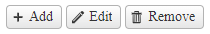

# Getting Started with the ChipList

This guide demonstrates how to get up and running with the Telerik WebForms ChipList.

After the completion of this guide, you will be able to achieve the following end result:



## Create the ChipList


#### In the Markup

- add a `telerik:RadChipList` element to the page
- and `telerik:ChipListItem` elements to the `Items` collection
- configure the `telerik:ChipListItem` options, like `Icon`, and `Label`.

Example

````ASP.NET
<telerik:RadChipList runat="server" ID="RadChipList1">
    <Items>
        <telerik:ChipListItem Icon="plus" Label="Add"  />
        <telerik:ChipListItem Icon="pencil" Label="Edit"  />
        <telerik:ChipListItem Icon="trash" Label="Remove"  />
    </Items>
</telerik:RadChipList>
````

#### Dynamically on Server-side

- create a new instance of a `RadChipList` object
- and `ChipListItem` objects to the `Items` collection
- configure the `ChipListItem` options, like `Icon`, and `Label`.
- add the `RadChipList` instance to the `Controls` collection of another control (e.g. `PlaceHolder1`)

Example

````C#
protected void Page_PreInit(object sender, EventArgs e)
{
    RadChipList chiplist = new RadChipList() { ID = "RadChipList1" };

    chiplist.Items.Add(new ChipListItem() { Icon = "plus", Label = "Add" });
    chiplist.Items.Add(new ChipListItem() { Icon = "pencil", Label = "Edit" });
    chiplist.Items.Add(new ChipListItem() { Icon = "trash", Label = "Remove" });

    PlaceHolder1.Controls.Add(chiplist);
}
````
````VB
Protected Sub Page_PreInit(ByVal sender As Object, ByVal e As EventArgs) Handles Me.PreInit
    Dim chiplist As RadChipList = New RadChipList() With {
        .ID = "RadChipList1"
    }

    chiplist.Items.Add(New ChipListItem() With {
        .Icon = "plus",
        .Label = "Add"
    })
    chiplist.Items.Add(New ChipListItem() With {
        .Icon = "pencil",
        .Label = "Edit"
    })
    chiplist.Items.Add(New ChipListItem() With {
        .Icon = "trash",
        .Label = "Remove"
    })

    PlaceHolder1.Controls.Add(chiplist)
End Sub
````

The `PlaceHolder1`

````ASP.NET
<asp:PlaceHolder ID="PlaceHolder1" runat="server"></asp:PlaceHolder>
````

>important Creating controls programmatically must be done in an early event such as **PreInit** (preferably), and **Init**. For more details you can check out the [ASP.NET Page Life-Cycle Events](https://learn.microsoft.com/en-us/previous-versions/aspnet/ms178472(v=vs.100)#life-cycle-events)

## Next Steps

- [Change the Appearance]()
- [Customize the ChipList]()
- [Enable Selection]()
- [Removable]()
- [Client-side Programming]()
- [Server-side Programming]()

## See Also

- [Overview]()
- [Change the Appearance]()
- [Customize the ChipList]()
- [Enable Selection]()
- [Removable]()
- [Client-side Programming]()
- [Server-side Programming]()
 
