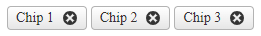

# Removable

This option will enable the items to be removable when clicking on the remove icon. 



To make the items removable, set the `Removable` property to `true`. Doing so, the ChipList will render a remove icon for the items.

Example

````ASP.NET
<telerik:RadChipList ID="RadChipList1" runat="server" Removable="true">
    <Items>
        <telerik:ChipListItem Label="Chip 1" />
        <telerik:ChipListItem Label="Chip 2" />
        <telerik:ChipListItem Label="Chip 3" />
    </Items>
</telerik:RadChipList>
````

## Next Steps

- [Client-side Programming]()
- [Server-side Programming]()

## See Also

- [Overview]()
- [Getting Started with the ChipList]()
- [Change the Appearance]()
- [Customize the ChipList]()
- [Enable Selection]()
- [Client-side Programming]()
- [Server-side Programming]()

 