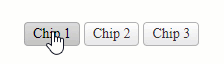
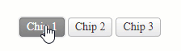
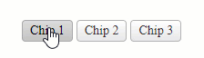

# Selection Mode

The ChipList provides options for setting its selection mode that will either prevent selecting the Chip items, allow selecting only one Chip item at a time, or allow selecting them all at the same time.

This option can be controlled through the `Selectable` property. The available options are:

* [`None`](#none-selection) (default)
* [`Single`](#single-selection)
* [`Multiple`](#multiple-selection)

## None Selection

The `None` selection mode disables the Chip selection.



Example

````ASP.NET
<telerik:RadChipList runat="server" Selectable="None">
    <Items>
        <telerik:ChipListItem Label="Chip 1"  />
        <telerik:ChipListItem Label="Chip 2"  />
        <telerik:ChipListItem Label="Chip 3"  />
    </Items>
</telerik:RadChipList>
````

## Single Selection

The `Single` selection mode enables selection for only one Chip at a time.



Example

 ````ASP.NET
<telerik:RadChipList runat="server" Selectable="Single">
    <Items>
        <telerik:ChipListItem Label="Chip 1"  />
        <telerik:ChipListItem Label="Chip 2"  />
        <telerik:ChipListItem Label="Chip 3"  />
    </Items>
</telerik:RadChipList>
````

## Multiple Selection

The `Multiple` selection mode enables selection for one or more Chips at the same time.



Example

````ASP.NET
<telerik:RadChipList runat="server" Selectable="Multiple">
    <Items>
        <telerik:ChipListItem Label="Chip 1"  />
        <telerik:ChipListItem Label="Chip 2"  />
        <telerik:ChipListItem Label="Chip 3"  />
    </Items>
</telerik:RadChipList>
````

## Next Steps

- [Removable]()
- [Client-side Programming]()
- [Server-side Programming]()

## See Also

- [Overview]()
- [Getting Started with the ChipList]()
- [Change the Appearance]()
- [Customize the ChipList]()
- [Removable]()
- [Client-side Programming]()
- [Server-side Programming]()

 