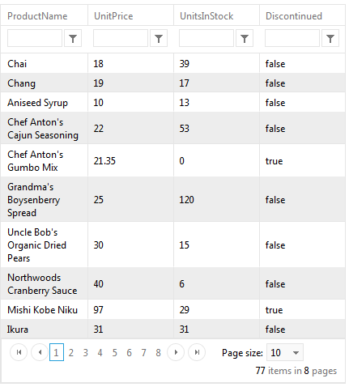

# Connecting to Web Service


In this topic, we will show how to bind a DataBound control to a **WebService** using the **RadClientDataSourceControl**.

## 

* From the **Toolbox** in **Visual Studio**, drag a **RadClientDataSource** instances to the design surface of your page.

* Set a **WebService** using the **Url** property. In this example we are using "**https://demos.telerik.com/kendo-ui/service/Northwind.svc/Products**"

````C#
<telerik:RadClientDataSource ID="RadClientDataSource1" runat="server">
    <DataSource>
        <WebServiceDataSourceSettings ServiceType="OData">
            <Select Url="https://demos.telerik.com/kendo-ui/service/Northwind.svc/Products" DataType="JSONP" />
        </WebServiceDataSourceSettings>
    </DataSource>
</telerik:RadClientDataSource>
````


* Configure the **Model Schema** and set the **Fileds** for the data source control

````C#
<telerik:RadClientDataSource ID="RadClientDataSource1" runat="server">
    <DataSource>
        <WebServiceDataSourceSettings ServiceType="OData">
            <Select Url="https://demos.telerik.com/kendo-ui/service/Northwind.svc/Products" DataType="JSONP" />
        </WebServiceDataSourceSettings>
    </DataSource>
    <Schema>
        <Model>
            <telerik:ClientDataSourceModelField FieldName="ProductName" DataType="String" />
            <telerik:ClientDataSourceModelField FieldName="QuantityPerUnit" DataType="String" />
            <telerik:ClientDataSourceModelField FieldName="UnitPrice" DataType="Number" />
            <telerik:ClientDataSourceModelField FieldName="UnitsInStock" DataType="Number" />
            <telerik:ClientDataSourceModelField FieldName="Discontinued" DataType="Boolean" />
        </Model>
    </Schema>
</telerik:RadClientDataSource>
````


* Assign the ClientDataSource to the **DataBound** control.


* The DataBound control will properly retrieve the data from the WebService

