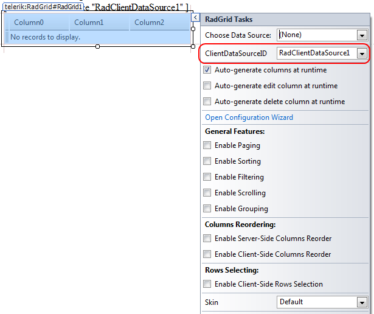

# Getting Started


The __RadClientDataSource__ control is a server-side __ASP.NET AJAX wrapper__ of the __Kendo.UI DataSource__ component, which could be used for performing various data source operations on the client. It fully supports binding to different kinds of web services and also provides both local and server-side support for __sorting__, __paging__, __filtering__, __grouping__, and __aggregates__.

With the steps below, we will show how to entirely bind a __RadGrid__ control to a __RadClientDataSource__ declaratively by involving the __Design Time__ of the control.

## 

1. From the __Toolbox__ in __Visual Studio__, drag a __RadClientDataSource__ and a __RadGrid__ instances to the design surface of your page.

1. Set a __WebService__ using the __Url__ property. In this example we are using "__http://demos.telerik.com/kendo-ui/service/Northwind.svc/Products__"

````C#
	    <telerik:RadClientDataSource ID="RadClientDataSource1" runat="server">
	            <DataSource>
	                <WebServiceDataSourceSettings ServiceType="OData">
	                    <Select Url="http://demos.telerik.com/kendo-ui/service/Northwind.svc/Products" DataType="JSONP" />
	                </WebServiceDataSourceSettings>
	            </DataSource>
	        </telerik:RadClientDataSource>
````


1. Configure the __Model Schema__ and set the __Fileds__ for the data source control

````C#
	    <telerik:RadClientDataSource ID="RadClientDataSource1" runat="server">
	            <DataSource>
	                <WebServiceDataSourceSettings ServiceType="OData">
	                    <Select Url="http://demos.telerik.com/kendo-ui/service/Northwind.svc/Products" DataType="JSONP" />
	                </WebServiceDataSourceSettings>
	            </DataSource>
	            <Schema>
	                <Model>
	                    <telerik:ClientDataSourceModelField FieldName="ProductName" DataType="String" />
	                    <telerik:ClientDataSourceModelField FieldName="QuantityPerUnit" DataType="String" />
	                    <telerik:ClientDataSourceModelField FieldName="UnitPrice" DataType="Number" />
	                    <telerik:ClientDataSourceModelField FieldName="UnitsInStock" DataType="Number" />
	                    <telerik:ClientDataSourceModelField FieldName="Discontinued" DataType="Boolean" />
	                </Model>
	            </Schema>
	        </telerik:RadClientDataSource>
````


1. Click on the smart tag of __RadGrid__ controland specify the __ClientdataSourceID__

1. Specify the RadGrid columns, their __DataFields__ and the other required settings like __paging__, __filtering__ ect.

````C#
	    <telerik:RadClientDataSource ID="RadClientDataSource1" runat="server">
	            <DataSource>
	                <WebServiceDataSourceSettings ServiceType="OData">
	                    <Select Url="http://demos.telerik.com/kendo-ui/service/Northwind.svc/Products" DataType="JSONP" />
	                </WebServiceDataSourceSettings>
	            </DataSource>
	            <Schema>
	                <Model>
	                    <telerik:ClientDataSourceModelField FieldName="ProductName" DataType="String" />
	                    <telerik:ClientDataSourceModelField FieldName="QuantityPerUnit" DataType="String" />
	                    <telerik:ClientDataSourceModelField FieldName="UnitPrice" DataType="Number" />
	                    <telerik:ClientDataSourceModelField FieldName="UnitsInStock" DataType="Number" />
	                    <telerik:ClientDataSourceModelField FieldName="Discontinued" DataType="Boolean" />
	                </Model>
	            </Schema>
	        </telerik:RadClientDataSource>
	        <telerik:RadGrid runat="server" ID="RadGrid1" ClientDataSourceID="RadClientDataSource1"
	            ResolvedRenderMode="Classic" Width="306px" Skin="Metro">
	            <MasterTableView DataKeyNames="ProductName">
	                <Columns>
	                    <telerik:GridBoundColumn DataField="ProductName" HeaderText="ProductName" UniqueName="column">
	                    </telerik:GridBoundColumn>
	                    <telerik:GridBoundColumn DataField="UnitPrice" HeaderText="UnitPrice" UniqueName="column1">
	                    </telerik:GridBoundColumn>
	                    <telerik:GridBoundColumn DataField="UnitsInStock" HeaderText="UnitsInStock" UniqueName="column2">
	                    </telerik:GridBoundColumn>
	                    <telerik:GridBoundColumn DataField="Discontinued" HeaderText="Discontinued" UniqueName="column3">
	                    </telerik:GridBoundColumn>
	                </Columns>
	            </MasterTableView>
	        </telerik:RadGrid>
````


>note Note that __autogenerated__ columns for the __RadGrid__ control are not supported with the __ClientDataSourceControl__ .
>


1. We are ready to view the page in the browser


