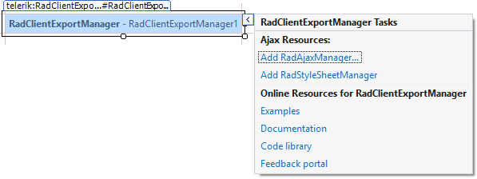

# Design Time

## Smart Tag

You can display the __RadClientExportManager__ Smart Tag by right clicking on the control in the Design window and choosing __Show Smart Tag__.
>caption Figure 1: RadClientExportManager Smart Tag

The Smart tag allows you to perform the following basic actions:

* The __Add RadAjaxManager__ link adds a __RadAjaxManager__ component to your Web page, so you can configure partial postbacks through a comfortable control.

* The __Add AddRadStyleSheetManager__ link adds a __RadStyleSheetManager__ to your Web page.

* Explore learning resources - the last section of the Smart Tag provides several links to online documentation and code library.

# See Also

 * [RadClientExportManager Getting Started]()
