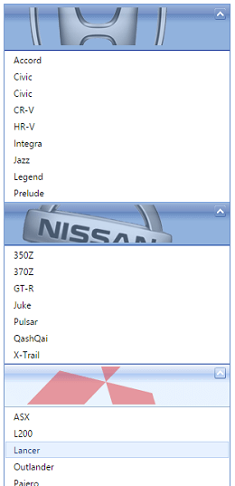
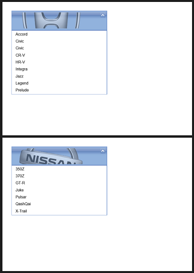

# PDF Multi-page Export


## PDF Multi-page Export

With **RadClientExportManager** you can split the exported content to different pages in the output PDF file. To do that use the **PageBreakSelector** property to specify the page breaks. A page will break before each element that matches the selector set as a value to the **PageBreakSelector** property.

**Example 1:** The following example demonstrates multi-page export of a **RadPanelBar** control:



You can export each of the **RadPanelBar's** root items and its content to a different page in the output PDF file by setting a **.pageBreak** CssClass to the root items and passing it to the **PageBreakSelector** property.


````ASP.NET
<telerik:RadClientExportManager runat="server" ID="RadClientExportManager1">
    <PdfSettings PageBreakSelector=".pageBreak" MarginRight="10mm" PaperSize="A5" Landscape="true" MarginBottom="10mm" MarginTop="10mm" MarginLeft="10mm" />
</telerik:RadClientExportManager>


<div class="exportButtonContainer">
    <telerik:RadButton RenderMode="Lightweight" ID="RadButton1" runat="server" OnClientClicked="exportAllPanelItems" Text="Export Items" AutoPostBack="false" UseSubmitBehavior="false"></telerik:RadButton>
</div>

<div class="panel-container">
    <telerik:RadPanelBar RenderMode="Lightweight" ID="RadPanelBar1" Skin="Web20" runat="server" Width="300">
        <Items>
            <telerik:RadPanelItem ImageUrl="images/Honda.png" CssClass="pageBreak" runat="server" Height="60" Expanded="True">
                <Items>
                    <telerik:RadPanelItem runat="server" Text="Accord" />
                    <telerik:RadPanelItem runat="server" Text="Civic" />
                    <telerik:RadPanelItem runat="server" Text="Civic" />
                    <telerik:RadPanelItem runat="server" Text="CR-V" />
                    <telerik:RadPanelItem runat="server" Text="HR-V" />
                    <telerik:RadPanelItem runat="server" Text="Integra" />
                    <telerik:RadPanelItem runat="server" Text="Jazz" />
                    <telerik:RadPanelItem runat="server" Text="Legend" />
                    <telerik:RadPanelItem runat="server" Text="Prelude" />
                </Items>
            </telerik:RadPanelItem>
			<telerik:RadPanelItem ImageUrl="images/Nissan.png" CssClass="pageBreak" runat="server">
                <Items>
                    <telerik:RadPanelItem runat="server" Text="350Z" />
                    <telerik:RadPanelItem runat="server" Text="370Z" />
                    <telerik:RadPanelItem runat="server" Text="GT-R" />
                    <telerik:RadPanelItem runat="server" Text="Juke" />
                    <telerik:RadPanelItem runat="server" Text="Pulsar" />
                    <telerik:RadPanelItem runat="server" Text="QashQai" />
                    <telerik:RadPanelItem runat="server" Text="X-Trail" />
                </Items>
            </telerik:RadPanelItem>
        </Items>
    </telerik:RadPanelBar>
</div>
````


````JavaScript
function exportAllPanelItems() {
    var cem = $find("<%=RadClientExportManager1.ClientID%>");
    cem.exportPDF($telerik.$(".panel-container"));
}
````


This is how the exported PDF file's content would look like:



## Page break limitations

Page breaking happens only inside text nodes. Therefore, if an element has no text content, it cannot be split across pages. For example an ``, or a `<div>` which has perhaps a border or background image, but otherwise no content, will not be split. If such elements fall on a page boundary, they will be moved to the next page (along with all the following DOM nodes), and if they don't fit on a single page they will be truncated.

Here is the current list of nodes that will not be split: ``, `<tr>`, `<iframe>`, `<svg>`, `<object>`, `<canvas>`, `<input>`, `<textarea>`, `<select>`, `<video>`.

Automatic page breaking cannot occur inside a positioned element (position: absolute). Moreover, elements with position: fixed are not supported at all (most likely they will not show up in the output). Such elements will simply be skipped over by the algorithm. For example, for the following input:


````ASP.NET
<p>Foo</p>
<div style="position: absolute; top: 1000px">Bar</div>
<p>Baz</p>
````


on an A4 page, the output will just display the Foo and Baz paragraphs. The positioned `<div>` would appear on the first page at height 1000, but that's beyond the page boundary so it will be clipped.

If the algorithm decides to move a node to the next page, all the DOM nodes following it will be moved as well, even if there might potentially be room for some of them on the current page. An example where this happens is with floating elements:


````ASP.NET
<p>
  some text before
  
  some text after
</p>
````


It can happen that this element ends up in a position where all the text fits on current page, but the image is higher and would fall on the boundary. In this case, the image and "some text after" will move to the next page.


You can find a live example of the **RadClientExportManager's** multi-page PDF export capabilities in the [PDF Multi Page Export](https://demos.telerik.com/aspnet-ajax/client-export-manager/functionality/pdf-multi-page-export/defaultcs.aspx) live demo. The demo also makes use of the **k-pdf-export** CssClass, which allows content that is not visible on the page to be exported by displaying it the exporting process.


# See Also

* [PDF Multi Page Export](https://demos.telerik.com/aspnet-ajax/client-export-manager/functionality/pdf-multi-page-export/defaultcs.aspx)

* [Change the Exported Content before Export]()

