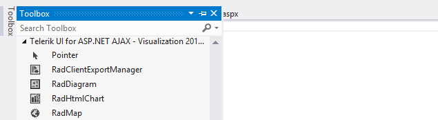

# Getting Started


This article will walk you through creating a **RadClientExportManager** control and exporting a Dom element to a PDF document.

## Creating a Simple RadClientExportManager

Drag a **RadClientExportManager** from the Toolbox onto your web page.
>caption Figure 1: RadClientExportManager in Visual Studio's Toolbox



## Sample declaration of RadClientExportManager in Source mode

The following code demonstrates the **RadClientExportManager**'s markup in Source mode:

````ASPNET
<telerik:RadClientExportManager runat="server" ID="RadClientExportManager1">
</telerik:RadClientExportManager>
````


## Export a Dom element to a PDF document

Export a div element with id "foo", using **RadClientExportManager**'s client-side API

````ASPNET
<div id="foo">Lorem ipsum dolor sit amet</div>

<telerik:RadClientExportManager runat="server" ID="RadClientExportManager1">
<PdfSettings filename="Myfile.pdf" />
</telerik:RadClientExportManager>
<input type="button" onclick="exportElement()" value="export" />

<script type="text/javascript">
function exportElement() {
	var exp = $find("<%= RadClientExportManager1.ClientID %>");
	exp.exportPDF($telerik.$("#foo"));
}
</script>
	
	
````


# See Also

 * [RadClientExportManager Client-Side API]()
