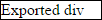
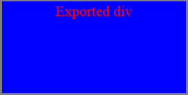
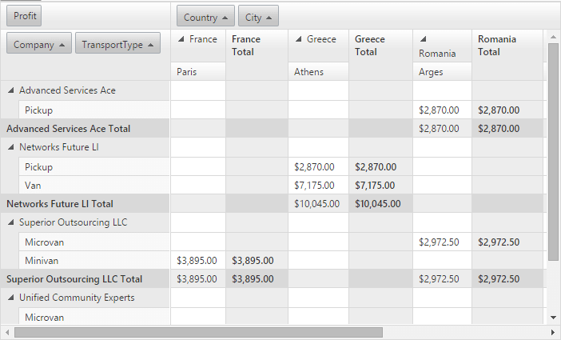
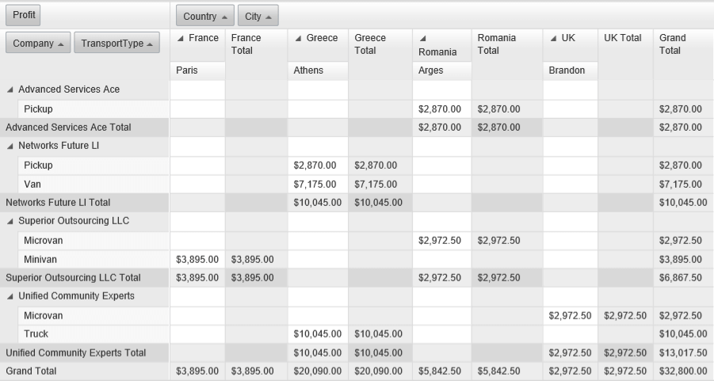

# Change the Exported Content before Export


This article demonstrates how you can change the exported content just before the export starts.

## 

The **k-pdf-export** CSS class is applied to the exported DOM element before the export starts and is removed after the element is exported. This makes possible applying styles to the element, the effect of which would be visible in the exported .PDF file, but they would not affect the element's appearance in the browser.  

**Example 1:** In the following example we are using the **k-pdf-export** class in the selector to apply several styles to a `<div>` element, changing its appearance in the exported .PDF file and keeping it unchanged in the browser.


The `<div>` before export:


````ASPNET
<div class="exported-div">Exported div</div>
````


````CSS
.exported-div {
    width: 100px;
    border: 1px solid black;
}
````





The styles we want to apply to the exported `<div>`:


````CSS
.k-pdf-export.exported-div {
    width: 200px;
    height: 100px;
    text-align: center;
    background-color: blue;
    color: red;
    border: 2px solid grey;       
}
````


This is how the exported `<div>` would look like in the .PDF file:



**Example 2:** Exporting all the columns of a **RadPivotGrid** 

Another common scenario, where changing the exported content could be needed, is when you want to export all the data displayed by a data summarization control such as the **RadPivotGrid.** If the total width of its columns exceeds the width of the **RadPivotGrid** a horizontal scrollbar will be displayed and exporting will be limited to the visible columns of the control. The **k-pdf-export** CSS class allows you to export all the data, you just have to add it to the selectors in the CSS rules responsible for removing the scrollbars. This way the **RadPivotGrid** would keep its scrollbars in the browser but the exported .PDF file would contain all the columns including those that are not visible in the browser at the moment of export.   

**RadPivotGrid** before the export:




````ASPNET
<div class="foo">
    <telerik:RadPivotGrid RenderMode="Lightweight" IgnorePaging="true" Width="700" Height="100%" runat="server" ID="RadPivotGrid1" OnNeedDataSource="RadPivotGrid1_NeedDataSource"
        AllowSorting="true" AllowFiltering="false" ShowFilterHeaderZone="false" RowTableLayout="Compact">
        <Fields>
            <telerik:PivotGridRowField DataField="Company">
            </telerik:PivotGridRowField>
            <telerik:PivotGridRowField DataField="TransportType">
            </telerik:PivotGridRowField>
            <telerik:PivotGridColumnField DataField="Country">
            </telerik:PivotGridColumnField>
            <telerik:PivotGridColumnField DataField="City">
            </telerik:PivotGridColumnField>
            <telerik:PivotGridAggregateField DataField="Profit" Aggregate="Sum" DataFormatString="{0:C}">
            </telerik:PivotGridAggregateField>
            <telerik:PivotGridAggregateField IsHidden="true" DataField="Expenses" Aggregate="Sum">
            </telerik:PivotGridAggregateField>
        </Fields>
        <ClientSettings>
            <Scrolling AllowVerticalScroll="true" SaveScrollPosition="true"></Scrolling>
        </ClientSettings>
    </telerik:RadPivotGrid>
</div>
````


CSS rules to remove the scrollbars and display all columns with **k-pdf-export** added to the selectors:


````CSS
.k-pdf-export .rpgVerticalScrollDiv,
.k-pdf-export .rpgHorizontalScroll > div {
    display: none;
}

.k-pdf-export .RadPivotGrid {
    display: inline-block;
}

.k-pdf-export .rpgColumnHeaderDiv {
    width: auto !important;
}

.k-pdf-export .RadPivotGrid,
.k-pdf-export .rpgContentZoneDiv {
    width: auto !important;
    height: auto !important;
}

.k-pdf-export .rpgRowHeaderZoneDiv {
    height: auto !important;
}
````


**RadClientExportManager** exporting the `<div>` element with class ".foo", which contains the **RadPivotGrid**:


````ASPNET
<telerik:RadClientExportManager runat="server" ID="RadClientExportManager1">               
    <PdfSettings FileName="MyFile.pdf" />
</telerik:RadClientExportManager>
<telerik:RadCodeBlock runat="server">
    <script type="text/javascript">
        function exportElement() {
            var exp = $find("<%= RadClientExportManager1.ClientID %>");
            var pivotGrid = $find("<%= RadPivotGrid1.ClientID %>");
            exp.exportPDF($telerik.$(".foo"));
        }
    </script>
</telerik:RadCodeBlock>
````


This is how the exported **RadPivotGrid** looks like in the .PDF file:




