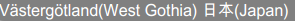

# Custom Fonts


This article demonstrates how you can use custom fonts to export non-ASCII characters to PDF.

## 

If you do not specify a font explicitly any non-ASCII characters the exported DOM element contains will not be exported to the PDF file.

**Example:** Consider the following `<div>` element, which contains Swedish and Japanese characters(Kanji):


````ASPNET
<div id="foo">Västergötland(West Gothia) 日本(Japan)</div>
````


````CSS
#foo {
    background-color: grey;
    color: white;
}
````

This is how it looks like in the browser:


Exporting this `<div>` to PDF would result in the following:


The special characters are missing in the exported file, because the standard fonts used in exporting to PDF do not support non-ASCII characters. In order to export them you have to use a custom font. The custom font that supports the special characters has to be added to the RadClientExportManager's **PdfSettings.Fonts** collection and set to the element you want to export (in this example the `<div>` "foo").

* We will include the Arial Unicode MS font in our project and add it to the **PdfSettings.Fonts** collection. It is an extended version of the Arial font and supports Unicode characters.


````C#
protected void Page_Load(object sender, EventArgs e)
{
    RadClientExportManager1.PdfSettings.Fonts.Add("Arial Unicode MS", "ArialUnicodeMS.ttf");
}
````
````VB.NET
Protected Sub Page_Load(sender As Object, e As EventArgs)
	RadClientExportManager1.PdfSettings.Fonts.Add("Arial Unicode MS", "ArialUnicodeMS.ttf")
End Sub
````


* Apply the font to the `<div>` "foo":


````CSS
#foo {
    font-family: 'Arial Unicode MS';
    background-color: grey;
    color: white;
}
````


* Export the `<div>`:


````ASPNET
<telerik:RadClientExportManager runat="server" ID="RadClientExportManager1">
    <pdfsettings filename="Myfile.pdf" />
</telerik:RadClientExportManager>
<input type="button" onclick="exportElement()" value="export" />

<script type="text/javascript">
    function exportElement() {
        var exp = $find("<%= RadClientExportManager1.ClientID %>");
        exp.exportPDF($telerik.$("#foo"));
    }
</script>
````


The non-ASCII characters are correctly exported and visible in the PDF file:



