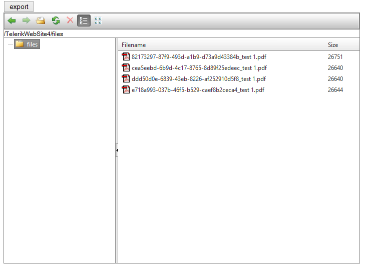

# Save Exported Files


This article demonstrates how to save the exported file on the server instead of returning it back to the client browser.

There are different ways to initiate such a request and to handle its server endpoint:

* [Use Page Method](#use-page-method)
* [Use Forced Proxy](#use-forced-proxy)
* [Use WebAPI](#use-webapi)
	* [Code Library: runnable example](http://www.telerik.com/support/code-library/export-and-save-file-with-web-api)

## Use Page Method

You can send the base64-encoded string from the client-side to the server directly via a [page method](http://www.telerik.com/blogs/different-ways-to-make-a-request-to-the-server). You can obtain the string in various ways, the easiest being to handle the client-side events of the ClientExportManager instance:

````ASP.NET
<asp:ScriptManager ID="Scriptmanager2" runat="server" EnablePageMethods="true" />
<telerik:RadClientExportManager runat="server" ID="RadClientExportManager1" OnClientPdfExporting="OnClientPdfExporting">
</telerik:RadClientExportManager>
<asp:Button ID="Button1" Text="store on server" OnClientClick="storeOnServer(); return false;" runat="server" />
<div class="forExport">I will be exported</div>
<script>
	function OnClientPdfExporting(sender, args) {
		args.set_cancel(true);
		var data = args.get_dataURI().split(',')[1];
		callMyPageMethod(data);
	}
	function storeOnServer() {
		var exportMngr = $find("<%= RadClientExportManager1.ClientID %>");
			exportMngr.exportPDF($telerik.$(".forExport"));
		}

		function callMyPageMethod(arg) {
			PageMethods.storeFile(arg, OnSucceeded, OnFailed);
		}

		function OnSucceeded(data) {
			alert(data);
		}

		function OnFailed(error) {
			alert(error.get_message());
		}
</script>
````

Sample implementation of a page method that only takes the file data.

````C#
[WebMethod]
public static string storeFile(string base64)
{
	byte[] fileContents = Convert.FromBase64String(base64);
	//store file on server here
	string path = "C:\\test\\some.pdf";
	File.WriteAllBytes(path, fileContents);

	return "I did it!";
}
````
````VB
<WebMethod> _
Public Shared Function storeFile(base64 As String) As String
	Dim fileContents As Byte() = Convert.FromBase64String(base64)
	'store file on server here
	Dim path As String = "C:\test\some.pdf"
	System.IO.File.WriteAllBytes(path, fileContents)
	Return "I did it!"
End Function
````

>tip See the [Use WebAPI](#use-webapi) example below for more examples of getting the data from the event arguments. You can add more information to the request and handle more file types and file names.

## Use Forced Proxy

You can use the underlying Kendo object to invoke the request and force the proxy usage, as shown in the [Force Proxy Usage](http://docs.telerik.com/kendo-ui/framework/save-files/introduction#force-proxy-usage) section of the Kendo UI documentation. You can find examples of endpoints that can tackle this request in the [Server Proxy Implementations](http://docs.telerik.com/kendo-ui/framework/save-files/introduction#server-proxy-implementations) section.

## Use WebAPI

In this example we will use Web API to send the file data to the server and perform the saving. The RadFileExplorer will be populated with the exported files as shown in the screenshot at the bottom of this article.It reads the files from the target folder ("files") and visualizes their filenames.

>caution In order to run this sample code you have to add all necessary assembly files that Web API requires and create a "files" folder at web site root level.
>


**Example 1:** The markup code contains: button, RadOrgChart and RadFileExplorer. When user clicks on the button it will initiate a request to the server and save the exported file in the files folder.

````ASPNET

<input type="button" onclick="exportElement()" value="export" />

<telerik:RadFilEexplorer ID="FileExplorer1" Configuration-deletepaths="~/files" runat="server" Configuration-viewpaths="~/files"></telerik:RadFilEexplorer>

<div id="Div1">
	<telerik:RadOrgChart RenderMode="Lightweight" ID="RadOrgChart2" runat="server">
		<Nodes>
			<telerik:OrgChartNode>
				<GroupItems>
					<telerik:OrgChartGroupItem Text="Manager">
					</telerik:OrgChartGroupItem>
				</GroupItems>
				<Nodes>
					<telerik:OrgChartNode>
						<GroupItems>
							<telerik:OrgChartGroupItem Text="Junior Developer">
							</telerik:OrgChartGroupItem>
						</GroupItems>
					</telerik:OrgChartNode>
					<telerik:OrgChartNode>
						<GroupItems>
							<telerik:OrgChartGroupItem Text="Junior QA">
							</telerik:OrgChartGroupItem>
						</GroupItems>
					</telerik:OrgChartNode>
				</Nodes>
			</telerik:OrgChartNode>
		</Nodes>
	</telerik:RadOrgChart>

	<telerik:RadClientExportManager runat="server" id="RadClientExportManager2" OnClientPdfExporting="OnClientPdfExporting">
		<PdfSettings FileName="MyFile.pdf" MarginBottom="20mm" />
	</telerik:RadClientExportManager>
</div>
````


**Example 2:** Here we send the raw data to the server using Ajax call and cancel the export execution.

````JavaScript
		
var $ = $telerik.$;

function OnClientPdfExporting(sender, args) {
	var dataRaw = args.get_dataURI().split(',');

	var data = {
		contentType: dataRaw[0].split(';')[0].split(':')[1],
		fileName: "test 1.pdf",
		base64: dataRaw[1]
	};

	$.ajax({
		type: "POST",
		data: data,
		url: "api/export/file",
		success: success
	});

	args.set_cancel(true);
}

function success() {
	$find("<%= FileExplorer1.ClientID %>").refresh();
}

function exportElement() {
   var exportMngr = $find("<%= RadClientExportManager1.ClientID %>");
	exp.exportPDF($telerik.$("#foo"));
}
	
	
````


This is the API controller class definition:


````C#

public class ExportController : ApiController
{
	[HttpPost]
	public HttpResponseMessage File(FormDataCollection values)
	{
		var contentType = values.Get("contentType");
		var base64 = values.Get("base64");
		var fileName = values.Get("fileName");

		var fileContents = Convert.FromBase64String(base64);


		System.IO.File.WriteAllBytes(System.Web.Hosting.HostingEnvironment.MapPath("~/files") + "\\" + Guid.NewGuid() + "_" + fileName, Convert.FromBase64String(base64));

		var response = new HttpResponseMessage();
		response.StatusCode = HttpStatusCode.OK;

		return response;
	}
}

````
````VB.NET

Public Class ExportController
	Inherits ApiController
	<HttpPost> _
	Public Function File(values As FormDataCollection) As HttpResponseMessage
		Dim contentType = values.[Get]("contentType")
		Dim base64 = values.[Get]("base64")
		Dim fileName = values.[Get]("fileName")

		Dim fileContents = Convert.FromBase64String(base64)


		System.IO.File.WriteAllBytes(System.Web.Hosting.HostingEnvironment.MapPath("~/files") + "\" + Guid.NewGuid().ToString() + "_" + fileName, Convert.FromBase64String(base64))


		Dim response = New HttpResponseMessage()
		response.StatusCode = HttpStatusCode.OK


		Return response
	End Function
End Class

````


>caption Figure 1: Shows how the RadFileExplorer is populated with the exported pdf files.



# See Also

 * [Export and save file with Web API](http://www.telerik.com/support/code-library/export-and-save-file-with-web-api)

 * [RadClientExportManager Client-Side API]()

 * [Kendo UI: Overview of File Saving](http://docs.telerik.com/kendo-ui/framework/save-files/introduction)

 * [Different ways to make a request to the server in ASP.NET](http://www.telerik.com/blogs/different-ways-to-make-a-request-to-the-server)
