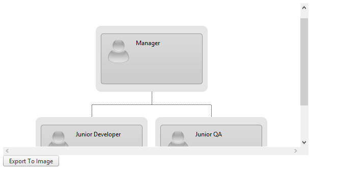
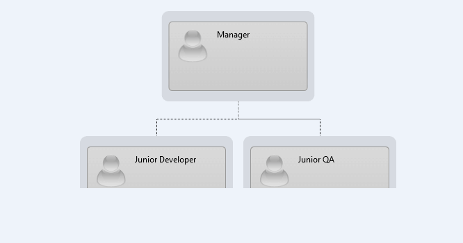
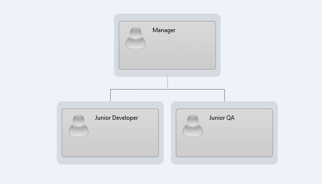

# WYSIWYG Export


This help article will explain about the so-called **What You See is What You Get** export functionality of **RadClientExportManager**.

## 

The [RadClientExportManager object API]() lets you export a specific DOM element.The most common scenario is to have a container element with a scroll bar (horizontal/, vertical or both) that contains other element(s).
>caption Figure 1: Here is a visual representation of a similar scenario.



**Example 1:** Here is the markup code.

````ASPNET
	
	
<div id="foo" style="width:600px; height:300px; overflow:scroll;">
	<telerik:RadOrgChart ID="RadOrgChart1" runat="server" Orientation="Vertical">
		<Nodes>
			<telerik:OrgChartNode>
				<GroupItems>
					<telerik:OrgChartGroupItem Text="text 1">
					</telerik:OrgChartGroupItem>
				</GroupItems>
				<Nodes>
					<telerik:OrgChartNode>
						<GroupItems>
							<telerik:OrgChartGroupItem Text="text 1">
							</telerik:OrgChartGroupItem>
						</GroupItems>
					</telerik:OrgChartNode>
				</Nodes>
			</telerik:OrgChartNode>
		</Nodes>
	</telerik:RadOrgChart>

	<telerik:RadClientExportManager runat="server" ID="RadClientExportManager1">
		<PdfSettings FileName="MyFile.pdf" MarginBottom="20mm" />
	</telerik:RadClientExportManager>

</div>

<telerik:RadButton ID="RadButton1" runat="server" AutoPostBack="false" OnClientClicked="OnClientClicked" Text="Export To Image"></telerik:RadButton>
````


In this case you have three possible ways to proceed:

* Export the container element (the div element with id="foo") - this will export the container and the nested element exactly as you see it on the image (without the scrollbars). See **Example 2** for source code.
>caption Figure 2: Shows the image if you export the "foo" element.



* Export the child element (the RadOrgChart element) - this will export the entire element stretched with its real dimensions. See **Example 3** for source code.
>caption Figure 2: Shows the image if you export the RadOrgChart element.



* Stretch the container's width and height in order to fit the child element without any scroll bars and export the container element. In our sample code you can remove the "foo" element width, height and overflow style properties. This way you will accomplish the result shown in **Figure 3** by exporting the "foo" element. You can use the same code from **Example 2**.
>caption Figure 3: Shows the image if you export the "foo" element when it is stretched to fit the child element.


**Example 2:** Shows how to export the "foo" div element.

````JavaScript
	
function OnClientClicked(sender, args) {
	var exportMngr = $find("<%= RadClientExportManager1.ClientID %>");
	var foo = $telerik.$("#foo");
	
	exportMngr.exportImage(foo);
}
	
````


**Example 3:** Shows how to export the RadOrgChart DOM element.

````JavaScript
	
function OnClientClicked(sender, args) {
	var exportMngr = $find("<%= RadClientExportManager1.ClientID %>");
	var orgChart = $find("<%= RadOrgChart1.ClientID %>");
	exportMngr.exportImage(orgChart.get_element());
}
	
````


# See Also

 * [RadClientExportManager Client-Side API]()
