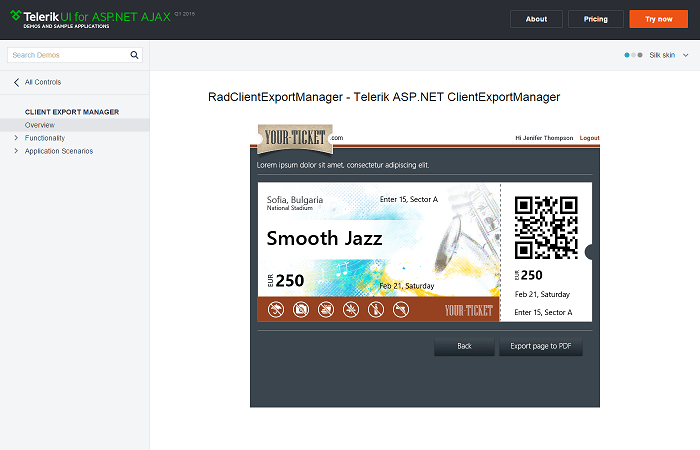

# ClientExportManager Overview

__RadClientExportManager__ for ASP.NET AJAX is a control that allows the user to export a specific DOM element or the entire page to a PDF document, image or scalable vector graphics (SVG) document. It is available since the __Q1 2015__ release.

## 

__RadClientExportManager__ is built on top of the [ Kendo UI Drawing API ](http://docs.telerik.com/kendo-ui/api/javascript/drawing/arc) and supports compression via the [ JavaScript pako library ](https://github.com/nodeca/pako) . Compression can make a big difference in the output file size when you're using custom TTF fonts or images with alpha channel (i.e. PNGs with transparency).
>caption Figure 1: Export to PDF with RadClientExportManager

# See Also
