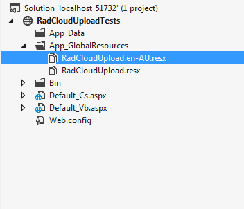

# Localizing RadCloudUpload


The localization support for **RadCloudUpload** lets you completely translate the user interface, or simply adapt a few strings.

## Localization Property

The **Localization** property specifies the strings that appear in the runtime user interface of **RadCloudUpload**. By changing the values of each named sub-property, you change the appearance of the string the control uses:

````ASPNET
	            <telerik:RadCloudUpload runat="server" ID="RadCloudUpload1" Localization-SelectButtonText="SelectFile"...>
	            </telerik:RadCloudUpload>
````


>note This technique is useful when customizing some of the messages of a particular instance. The messages are not shared between upload instances. A complete translation using this approach is not appropriate.
>


>caption  

| Key | Default Value | Description |
| ------ | ------ | ------ |
|Localization-SelectButtonText|Select|Sets the text of the **Select** button.|
|Localization-Cancel|Cancel|Sets the text of the **Cancel** button. (visible when the FileListPanelSettings-RenderButtonText property is set to True)|
|Localization-CollapseButton|Collapse Button|Sets the text of the **Collapse** button.|
|Localization-Error|Error|Sets the text of the **Error** message.|
|Localization-ExpandButton|ExpandButton|Sets the text of the **Expand** button.|
|Localization-ExtensionValidationFailedMessage|Extension validation failed|Sets the text of the **ExtensionValidationFailedMessage** message.|
|LocalizationPath|N/A|Use this property, when you need to load the localization files from another directory.|
|Localization-Remove|Remove|Sets the text of the **Remove** button.|
|Localization-ServerErrorMessage|Error occured during file upload|Sets the text of the **ServerErrorMessage** message.|
|Localization-SizeValidationFailedMessage|Size validation failed|Sets the text of the **SizeValidationFailedMessage** .|
|Localization-UploadedFilesMessage|Uploaded Files|Sets the text of the **UploadedFilesMessage** .|
|Localization-UploadingFilesMessage|Uploading Files|Sets the text of the **UploadingFilesMessage** .|

## Global Resource Files

The primary means for localization in ASP.NET is to use resource files. Resource files are simple XML files that can be easily edited and transferred to other applications. You can use resource files to change the default (English) localization for **RadCloudUpload** that is stored in the **Telerik.Web.UI** assembly.

To create a global resource file to localize the upload follow these steps:

1. Create the **App_GlobalResources** folder in the root of your web application.

2. Copy the default resource **RadCloudUpload.resx** file into it. This file can be found in the **App_GlobalResources** folder of the directory where you installed the RadControls.

3. Make a copy of the file and rename the copy so that its name contains the Culture Identifier. The resource files used by RadCloudUpload follow a strict naming convention:

**RadCloudUpload.`<Culture Identifier>`.resx**

>note The **Culture Identifier** consists of a language code followed by a dash and the country code. Example: “en-US”, “fr-CA” and so on.
>


For example RadCloudUpload.en-AU.resx. Both files should be present in the **App_GlobalResources** folder:



4. Edit the strings using the Visual Studio editor or your favorite text editor. Customize strings just as you would set the **Localization** property.


>caution Make sure that the **ReservedResource** message is preserved. It is used for identification purposes and is never displayed.
>


You can now switch the upload so that it uses your new resource file by setting the active culture:


