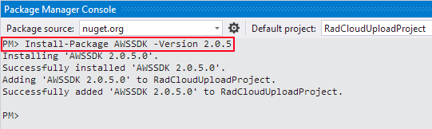
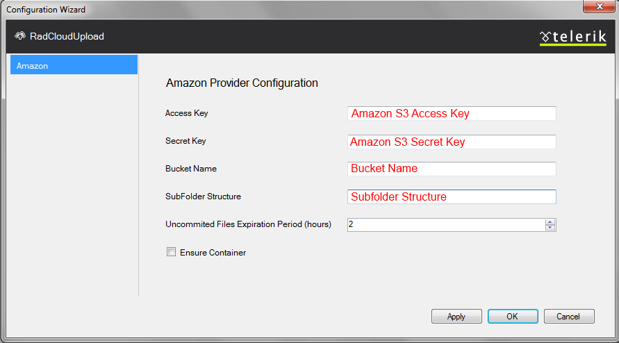

# Amazon S3

To use the built-in Amazon S3 storage provider, you need to:

1. [Add references to the necessary assemblies](#adding-references)
1. [Configure the RadCloudUploadInstance](#configuration)

## Adding References

To upload files in Amazon S3 (or Amazon Simple Storage Service) **RadCloudUpload** depends on the [AWS SDK for .NET](http://aws.amazon.com/sdkfornet/). This package can be installed from the [NuGet Repository](http://www.nuget.org/packages/AWSSDK/) via the **Package Management Console** with the `Install-Package` command.

Depending on the Telerik.Web.UI.dll version you use, you need to use a different version of the Amazon S3 package(s):

* for **R1 2017 (2017.1.118)** and later—you need version 3 of the [AWSSDK.Core.dll](https://www.nuget.org/packages/AWSSDK.Core/) and [AWSSDK.S3.dll](https://www.nuget.org/packages/AWSSDK.S3/):

	**Console**

		Install-Package AWSSDK.Core 
		Install-Package AWSSDK.S3

* for **Q1 2014 (2014.1.225) to R3 2016 SP2 (2016.2.1027)**—you need the now old version 2.0.5 of AWSSDK:

	**Console**

		Install-Package AWSSDK -Version 2.0.5

* for **R2 2013 SP2 and earlier**—you need the now old version 1.5.45 of AWSSDK:

	**Console**

		Install-Package AWSSDK -Version 1.5.45

>caption Example of using the NuGet Package Manager Console to add the Amazon packages

>note The package management tool will add the necessary **AWSSDK.dll** assembly/assemblies to the solution.
>When a Web Application type of project is used, the **Copy Local** property in the `Reference` `Properties` dialog box, available from the `References` pane of the Project Designer, must be set to **True** .
>

## Configuration

**RadCloudUpload** supports file uploading in Amazon S3. Configuration requires to set **Access Key**, **Secret Key** and **Bucket Name**.

1. From **RadCloudUpload**'s smart tag choose Amazon as provider tag and open the **Configuration Wizard**:

1. In the **Configuration Wizard** dialog enter Amazon S3 **Access Key**, **Secret Key** and **Bucket Name**. Specifying the **Uncommitted Files Expiration Period**(TimeSpan Structure), you could easily configure the time, after which the unprocessed files will be removed from the storage.When **Ensure Container** is checked, the control will create a new Bucket if it doesn't exist. In case it is not checked and the Bucket doesn't exist - an exception will be thrown.This will add configuration setting in the **web.config** file:

	**XML**
	
		<telerik.web.ui>
			<radCloudUpload>
				<storageProviders>
					<add name="Amazon" type="Telerik.Web.UI.AmazonS3Provider" accessKey="" secretKey="" bucketName="" uncommitedFilesExpirationPeriod="2" />
				</storageProviders>
			</radCloudUpload>
		</telerik.web.ui>

>caution Uploading files in Amazon S3 is performed in chunks. Default chunk size defined by Amazon is 5 MB. Because the default ASP.NET size request is 4MB, you must increase it, in order to avoid errors. This can be done by increasing the value of [MaxRequestLength]() property. Chunks which are not uploaded will be removed automatically by **RadCloudUpload** .
>

# See Also

 * [Custom Storage Providers]()

 * [Custom Amazon Storage Provider]()

 * [Troubleshooting]()

 * [RadCloudUpload Changes and Backwards Compatibility]()
