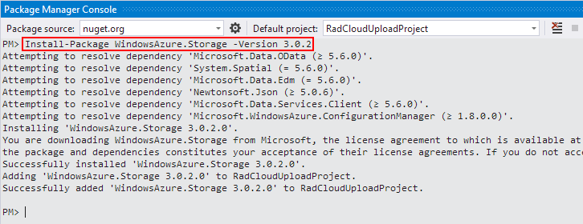
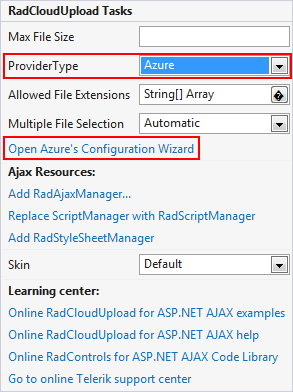

# Azure Blob Storage

## Adding References

**RadCloudUpload** can upload files to Azure Blob Storage. It is built on the top of [Windows Azure Blob Storage Service in .NET](http://www.windowsazure.com/en-us/documentation/articles/storage-dotnet-how-to-use-blobs-20/). To work properly, the control needs a reference to some of the client libraries included in the [Windows Azure Storage](http://www.nuget.org/packages/WindowsAzure.Storage/) which is a part of [Windows Azure SDK for .NET](http://www.windowsazure.com/en-us/develop/net/).

**Windows Azure Storage** package is distributed via NuGet repository and can be easily installed through the Package Management Console. Use the following command to install the appropriate version you need:

**Install-Package WindowsAzure.Storage -Version 1.7.0.0** - for Telerik.Web.UI .NET3.5, .NET4.0, .NET4.5 version 2013.3.1324 or earlier.

**Install-Package WindowsAzure.Storage -Version 1.7.0.0** - for Telerik.Web.UI .NET3.5 version 2014.1.XXXXor later.

**Install-Package WindowsAzure.Storage -Version 3.0.2** - for Telerik.Web.UI .NET4.0, .NET4.5 version 2014.1.XXXX or later.

>note The package management tool will a few assemblies. **CloudUpload** requires:
> *Microsoft.WindowsAzure.StorageClient, Microsoft.WindowsAzure* assemblies for **Telerik.Web.UI .NET3.5, .NET4.0, .NET4.5 version 2013.3.1324** or earlier and **Telerik.Web.UI .NET3.5 version 2014.1.XXXX** or later.
> *Microsoft.WindowsAzure.Storage, Microsoft.WindowsAzure.Storage.Auth, Microsoft.WindowsAzure.Storage.Blob* assemblies for **Telerik.Web.UI .NET4.0, .NET4.5 version 2014.1.XXXX** or later.
>The other assemblies can be removed.
>When Web Application is used the Copy Local property in the Reference Properties dialog box, available from the References pane of the Project Designer must be set to **True** .
>

## Configuration

1. From the **RadCloudUpload**'s smart tag choose Azure as provider tag and open the Configuration Wizard: 

2. In the Configuration Wizard dialog enter Azure **Access Key**, **Account Name** and **Blob Container Name**.Specifying the **Uncommitted Files Expiration Period**(TimeSpan Structure), you could easily configure the time, after which the unprocessed files will be removed from the storage.When **Ensure Container** is checked, the control will create a new Container if it doesn't exists. In case it is not checked and the Container doesn't exists - an exception will be thrown.This will add configuration setting in the **web.config** file:

	**XML**
	
		<telerik.web.ui>
			<radCloudUpload>
				<storageProviders>
					<add name="Azure" type="Telerik.Web.UI.AzureProvider" accountKey="" accountName="" blobContainer="" subFolderStructure="" ensureContainer="true" uncommitedFilesExpirationPeriod="2" defaultEndpointsProtocol="https" />
				</storageProviders>
			</radCloudUpload>
		</telerik.web.ui>

>note Uploading in Azure is done on chunks. Every chunk has size of 2MB. These chunks that were cancelled during the uploading are removed automatically by Azure. When older browsers are used (IE9 or below), files are uploaded at once, because chunking is not supported. In order to upload files larger than 4MB, it is needed to increase the maximum allowed file size. For more details please refer to this [article]().
>

# See Also

 * [Custom Storage Providers]()

 * [Cistom Azure Blob Storage Provider]()

 * [Troubleshooting]()
