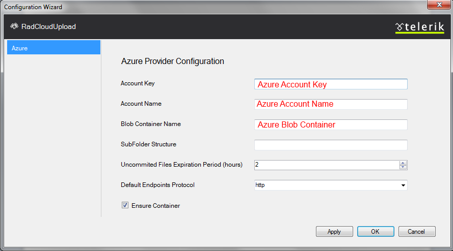

# Azure Blob Storage

To use the built-in Azure Blob provider that comes with RadCloudUpload, you must:

1. [Add the necessary references](#adding-references)
1. [Configure the provider](#configuration)

## Adding References

**RadCloudUpload** can upload files to Azure Blob Storage. It is built on the top of [Windows Azure Blob Storage Service in .NET](http://www.windowsazure.com/en-us/documentation/articles/storage-dotnet-how-to-use-blobs-20/). To work properly, the control needs a reference to some of the client libraries included in the [Windows Azure Storage](http://www.nuget.org/packages/WindowsAzure.Storage/) which is a part of [Windows Azure SDK for .NET](http://www.windowsazure.com/en-us/develop/net/).

The **Windows Azure Storage** package is distributed through a **NuGet** feed and can be easily installed through the Package Management Console. **Table 1** shows the command to install the version you need according to the Telerik.Web.UI version you use.

>caption Table 1: Package Manager command to restore the appropriate NuGet package, depending on the Telerik version and the .NET your project is targetting

| Telerik.Web.UI version | Targetting .NET 4.0 and later             | Targetting .NET 3.5                     |
|------------------------|------------------------------------------|------------------------------------------|
| >= 2014.1.225          | Install-Package WindowsAzure.Storage -Version 3.0.2 | Install-Package WindowsAzure.Storage -Version 1.7.0.0 |
| < 2013.3.1324          | Install-Package WindowsAzure.Storage -Version 1.7.0.0 | Install-Package WindowsAzure.Storage -Version 1.7.0.0 |

>caption Figure 1: Example of using the NuGet Package Manager Console to add the Azure package

For version **`3.0.2`**, only the **`Microsoft.WindowsAzure.Storage.dll`** assembly with version **`3.0.2.0`** is used by RadCloudUpload. 

For version **`1.7.0.0`**, only the **`Microsoft.WindowsAzure.StorageClient.dll`** assembly with version **`6.0.6002.18488`** is used by RadCloudUpload.

The `Microsoft.WindowsAzure.Configuration.dll` assembly is not used, but the other dependencies may be used by the Azure code.

>tip When a Web Application type of project is used the **Copy Local** property in the **Reference** Properties dialog box, available from the References pane of the Project Designer must be set to **True** .

If you use newer versions of the `WindowsAzure.Storage` package, there is a risk of a breaking change in the library to break RadCloudUpload. File uploads may stop working or you may get errors such as `NullReferenceException` from `Telerik.Web.UI.CloudUploadHandler.GetEncryptedText`.

## Configuration

1. From the **RadCloudUpload**'s smart tag choose Azure as provider tag and open the Configuration Wizard: 

2. In the Configuration Wizard dialog enter Azure **Access Key**, **Account Name** and **Blob Container Name**.Specifying the **Uncommitted Files Expiration Period**(TimeSpan Structure), you could easily configure the time, after which the unprocessed files will be removed from the storage.When **Ensure Container** is checked, the control will create a new Container if it doesn't exists. In case it is not checked and the Container doesn't exists - an exception will be thrown.This will add configuration setting in the **web.config** file:

	**XML**
	
		<telerik.web.ui>
			<radCloudUpload>
				<storageProviders>
					<add name="Azure" type="Telerik.Web.UI.AzureProvider" accountKey="" accountName="" blobContainer="" subFolderStructure="" ensureContainer="true" uncommitedFilesExpirationPeriod="2" defaultEndpointsProtocol="https" />
				</storageProviders>
			</radCloudUpload>
		</telerik.web.ui>

>tip Uploading in Azure is done on chunks. Every chunk has size of 2MB. These chunks that were cancelled during the uploading are removed automatically by Azure. When older browsers are used (IE9 or below), files are uploaded at once, because chunking is not supported. In order to upload files larger than 4MB, it is needed to increase the maximum allowed file size. For more details please refer to this [article]().
>

# See Also

 * [Custom Storage Providers]()

 * [Custom Azure Blob Storage Provider]()

 * [Troubleshooting]()
