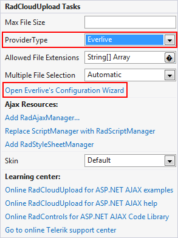
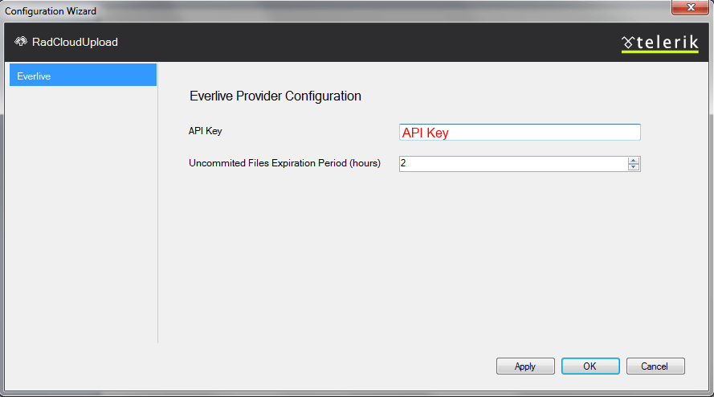

# Telerik Backend Services


[ Telerik Backend Services (formerly Everlive) ](http://www.telerik.com/backend-services) connects your applications to backend cloud storages of Telerik's Cloud Services Platform. Integration with **RadCloudUpload** is easy and requires only an **API Key**.

## Adding References

In order to be able to use the Telerik Backend Services Cloud Storage Provider, you would need the download the **dll files** from [ here ](https://www.everlive.com/Files/SDK/Windows/EverliveSDK.Windows.Net35.zip).

>note Telerik Backend Services requires reference to **Telerik.Everlive.Sdk.dll** and **Newtonsoft.Json.dll** .
>When Web Application is used the Copy Local property in the Reference Properties dialog box, available from the References pane of the Project Designer must be set to **True** .
>


## Configuration


1. From the **RadCloudUpload**'s smart tag choose Everlive as provider and open the Configuration Wizard: 

1. In the Configuration Wizard dialog enter Everlive **API Key**. Specifying the **Uncommitted Files Expiration Period**(TimeSpan Structure), you could easily configure the time, after which the unprocessed files will be removed from the storage.This will add configuration setting in the **web.config** file:

````XML
<telerik.web.ui>
	<radCloudUpload>
		<storageProviders>
			<add name="Everlive" type="Telerik.Web.UI.EverliveProvider" AppKey="" uncommitedFilesExpirationPeriod="2"/>
		</storageProviders>
	</radCloudUpload>
</telerik.web.ui>
````


>note Telerik Backend Services doesn't support uploading in chunks - files are uploaded at once. In case you want to upload files, larger than 4MB refer to this [article]().
>


# See Also

 * [Custom Storage Providers]()

 * [Custom Telerik Backend Services Provider]()

 * [Troubleshooting]()
