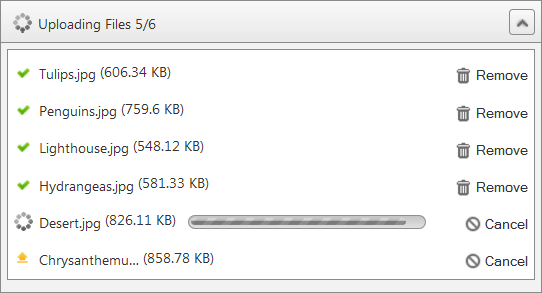

# File List Panel


## File List Panel Overview

**File List Panel** is the visible area where selected files are listed. It provides information about file uploading - current progress, successfully uploaded files and failed uploads. The size of the **File List Panel** can be configured by changing its properties. Furthermore it can be docked to any html element on the page. This is possible by setting the **PanelContainerSelector** property.


>caption  

| Name | Type | Description |
| ------ | ------ | ------ |
| **PanelContainerSelector** |string|Gets or sets the zone, where the file list panel will be displayed. The value of the property should be a valid jQuery selectors. E.g. class name or Id of html element.|
| **Height** |Unit|Gets or sets the height of the file list panel.|
| **MaxHeight** |Unit|Gets or sets the maximum height of the file list panel.|
| **Width** |Unit|Gets or sets the width of the file list panel.|
| **RenderButtonText** |bool|When set to true enables rendering of text on the buttons.|
| **ShowEmptyFileListPanel** |bool|Gets or sets the whether the file list panel will be displayed when no files are uploaded.|

````ASP.NET
<telerik:RadCloudUpload ID="RadCloudUpload1" runat="server" ProviderType="Azure" MultipleFileSelection="Automatic">
	<FileListPanelSettings PanelContainerSelector="#fileList" Height="250px" MaxHeight="300px" Width="450px" RenderButtonText="true" ShowEmptyFileListPanel="true" />
</telerik:RadCloudUpload>

<div id="fileList"></div>
````


