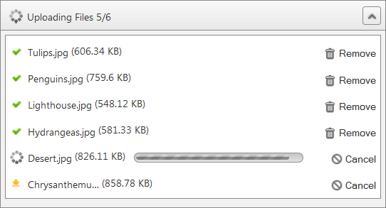

# File List Panel


## File List Panel Overview

__File List Panel__ is the visible area where selected files are listed. It provides information about file uploading - current progress, successfully uploaded files and failed uploads. The size of the__File List Panel__ can be configured by changing its properties. Furthermore it can be docked to any html element on the page. This is possible by setting the __PanelContainerSelector__ property.


>caption  

| Name | Type | Description |
| ------ | ------ | ------ |
| __PanelContainerSelector__ |string|Gets or sets the zone, where the file list panel will be displayed. The value of the property should be a valid jQuery selectors. E.g. class name or Id of html element.|
| __Height__ |Unit|Gets or sets the height of the file list panel.|
| __MaxHeight__ |Unit|Gets or sets the maximum height of the file list panel.|
| __Width__ |Unit|Gets or sets the width of the file list panel.|
| __RenderButtonText__ |bool|When set to true enables rendering of text on the buttons.|
| __ShowEmptyFileListPanel__ |bool|Gets or sets the whether the file list panel will be displayed when no files are uploaded.|

````ASPNET
	            <telerik:RadCloudUpload ID="RadCloudUpload1" runat="server" ProviderType="Azure" MultipleFileSelection="Automatic">
	                <FileListPanelSettings PanelContainerSelector="#fileList" Height="250px" MaxHeight="300px" Width="450px" RenderButtonText="true" ShowEmptyFileListPanel="true" />
	            </telerik:RadCloudUpload>
	
	            <div id="fileList"></div>
````


