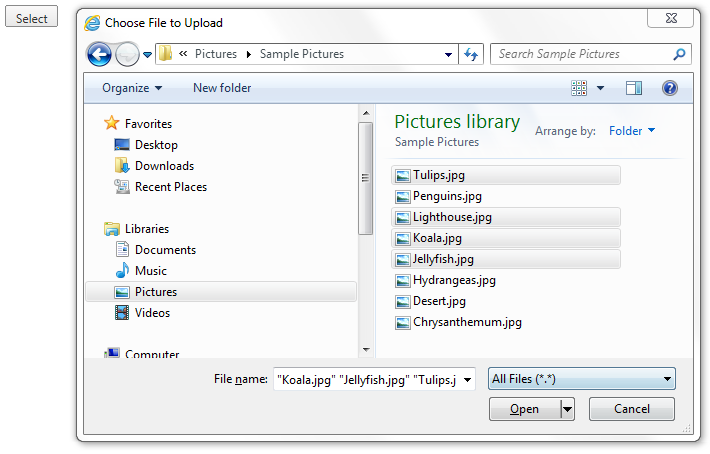

# Multiple File Selection

## Multiple File Selection

With __RadCloudUpload__ it is possible to select multiple files. This can be achieved by setting the __MultipleFileSelection__ property to __Automatic__. Multiple file selection is possible only when client's browser supports HTML5 File API (FireFox, Chrome, Opera and IE10+).
