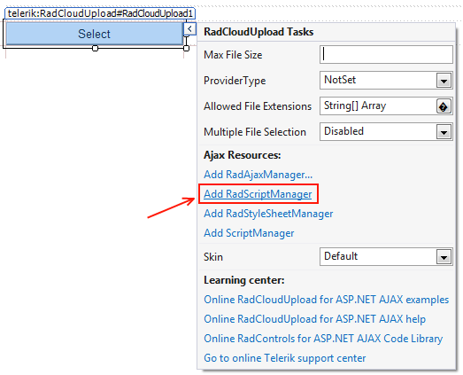

# Getting Started

This tutorial will walk you through creating a Web page that uses **RadCloudUpload** control. It shows how to use **RadClodUpload** to upload files.

## Getting Started

1. Create a new page and add a **RadCloudUpload** control to it.

1. Click the Smart Tag of the **RadCloudUpload** control to add **RadScriptManager** to the page:
>caption Figure 1. Adding RadScriptManager

1. Adding the **RadAScriptManager** will automatically register the **Telerik.Web.UI.WebResource.axd** handler in the web.config file. This handler is used by both **RadScriptManager** and **RadCloudUpload** as demonstrated in the Figure 2. below:
>caption Figure 2. Registering Telerik.Web.UI.WebResource.axd handler

1. Select and configure the **ProviderType** as in Figure 3:
>caption Figure 3. Provider Type

>caution All Cloud Storage Providers are depending on third party assemblies. To learn how to reference and configure them look at the[ Telerik Backend Services (formerly Everlive) ](),[ AmazonS3 ]()or[ Azure ]()Cloud Storages Sections.
>

# See Also

 * [Configuring Telerik Backend Services Provider]()

 * [Configuring Azure Blob Storage Provider]()

 * [Configuring Amazon S3 Provider]()

 * [Troubleshooting]()
