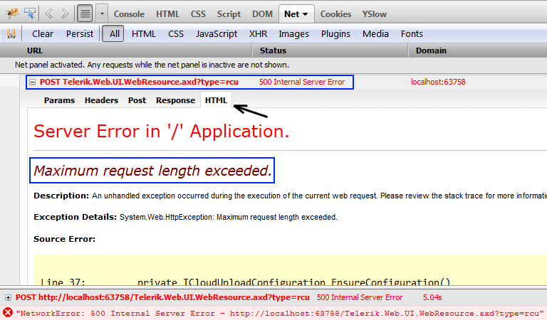

# CloudUpload Troubleshooting

**RadCloudUpload**’s Cloud Storage Providers may cause many issues if they are not configured properly. This help topic tries to explain how to troubleshoot the most common issues.

## Troubleshooting

**Example Exception**

`uncaught exception: Error while uploading, HTTP code: 404`

This means that the request URL was not found. Most common HTTP error codes are listed below:


1. Response Redirect - 302

1. Bad Request - 400

1. Unauthorized - 401

1. Forbidden - 403

1. Not Found - 404

1. Internal Error - 500

1. Not Implemented - 501


More information regarding the different types of HTTP error codes can be found [here](http://www.w3.org/Protocols/rfc2616/rfc2616-sec10.html).

Content


1. [Missing assembly reference](#missing-assembly-reference) 

1. [Missing or incorrect handler registration](#missing-handler-registration) 

1. [Configuring RadCloudUpload for Windows or Forms authentication](#configuring-radcloudupload-for-windows-or-forms-authentication) 

1. [Uploading large files](#increasing-the-maxrequestlength-size) 

1. [Extracting detailed error information](#extract-error-information)


## Missing Assembly Reference

**RadCloudUpload** depends on third party libraries to support all the different Cloud Storage Providers. If assembly reference is missing uploading will fails with one of the following error messages: 


* **Missing reference to Amazon SDK** -  *Telerik.Web.UI.RadCloudUpload with ID='RadCloudUpload1' was unable to find a reference to AWSSDK.dll. Please, make sure that you have added a reference to the this assembly in your project*. 


* **Missing reference to Azure SDK** -  T*elerik.Web.UI.RadCloudUpload with ID='RadCloudUpload1' was unable to find a reference to Microsoft.WindowsAzure.StorageClient.dll. Please, make sure that you have added a reference to the this assembly in your project*. 


* **Missing reference to Telerik Backend Services (formerly Everlive) SDK** -  *Telerik.Web.UI.RadCloudUpload with ID='RadCloudUpload1' was unable to find a reference to Telerik.Everlive.Sdk.dll. Please, make sure that you have added a reference to the this assembly in your project*. 


* **Missing reference to Newtonsoft assembly** -  *Telerik.Web.UI.RadCloudUpload with ID='RadCloudUpload1' was unable to find a reference to Newtonsoft.Json.dll. Please, make sure that you have added a reference to the this assembly in your project*.

>tip **RadCloudUpload** has a **EnableAssembliesDetection** property. By default it is enabled. This property indicates if **RadCloudUpload** should check whether the Amazon, Azure, Telerik Backend Services (and Newtonsoft) assemblies are referenced to the project.

## Missing Handler Registration

One of the most common cause for failures is a missing or incorrect **Telerik.Web.UI.WebResource.axd** handler registration. 

 Detailed information on how to register this handler can be found here - [Web Resources Troubleshooting]().

In case of failure this error message will be displayed: *'~/Telerik.Web.UI.WebResource.axd' is missing in web.config. RadCloudUpload requires a HttpHandler registration in web.config. Please, use the control Smart Tag to add the handler automatically, or see the help for more information: Controls > RadCloudUpload*

>tip **RadCloudUpload** has a **EnableHanlderDetection** property. By default it is enabled. This property cause s **RadCloudUpload** to check if the Telerik.Web.UI.WebResource handler exists in the application configuration file.

## Configuring RadCloudUpload for Windows or Forms Authentication

The RadCloudUpload handler must be excluded from Windows Authentication (NTLM) and Forms Authentication. The Flash module will not authenticate in either mode.

````XML
<location path="Telerik.Web.UI.WebResource.axd">   
    <system.web>       
        <authorization>
            <allow users="*" />       
        </authorization>   
    </system.web>
</location>
````

>tip Anonymous Authentication must be enabled in IIS. If AA is disabled, you must disable the RadCloudUpload Flash module altogether by inserting this script right before the control definition on the page:

**RadCloudUpload** will add Configuration Section automatically, when Cloud Storage Provider is set through the Visual Studio Designer. In some cases Cloud Storage Provider may be added manually to the web.config. If this happen Visual Studio will indicates a compile time error "**Unrecognized configuration section telerik.web.ui.**". This error will not appear if the **RadCloudUpload** configuration section exists in **web.config** file.

````XML
<configuration>
    <configSections>
        <sectionGroup name="telerik.web.ui">
            <section name="radCloudUpload" type="Telerik.Web.UI.CloudUploadConfigurationSection" allowDefinition="MachineToApplication" requirePermission="false" />
        </sectionGroup>
    </configSections>
    ...
</configuration>
````


## Increasing the MaxRequestLength Size

Very often the default size (4MB) of the ASP.NET **MaxRequestLength** property is not enough and is one of the most common reasons for upload failures. Most application scenarios require to allow uploading for larger files. For example when Amazon S3 provider is used uploading is done on chunks. Every chunk has size of 5MB. **RadCloudUpload** will not able to upload files unless **MaxRequestLength** is increased. Same will be when old browser (IE9 or below) that doesn't support File API is used. In this case **RadCloudUpload** will used its IFrame module and files will be submitted with a form. 

 When upload fails, because of **MaxRequestLength** property, the returned HTTP Code by the server is 500. Detailed information about the unsuccessful uploads can received from the browser’s Web developer Tools:



>caution **RadCloudUpload** uses upload modules. For all new browsers that support HTML5 File API feature, the preferred module is **File API**. For all older browser **IFrame** module is used.

## Extract Error Information

Failures that occur during upload often lack detailed error information. In case of failure [OnClientUploadFailed]() event will be fired. The thrown error message will be returned by its arguments.

````JavaScript
<script type="text/javascript">
    function OnClientUploadFailed(sender, args) {
        var error = args.get_message();
        console.log(error);
    }
</script>
````

