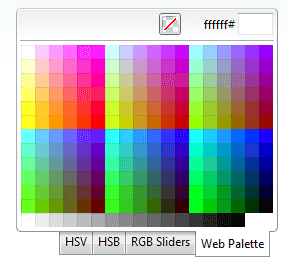

# Right-to-left Support


**RadColorPicker** fully supports right-to-left (RTL) language locales. In order to turn on the RTL support you should set **dir=rtl to the html or body** element or at least to its parent element. You can also use the **direction:rtl** CSS property.

````ASP.NET
<div dir="rtl">
    <telerik:RadColorPicker RenderMode="Lightweight" runat="server" ID="RadColorPicker1" PaletteModes="All">
    </telerik:RadColorPicker>
</div>
````



# See Also

 * [See this live in an online demo](https://demos.telerik.com/aspnet-ajax/colorpicker/examples/righttoleft/defaultcs.aspx)
