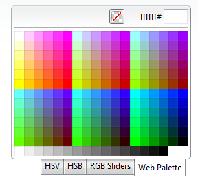

# Right-to-left Support


## 

The __RadColorPicker__ fully supports right-to-left (RTL) language locales. In order to turn on the RTL support you should set __dir=rtl to the html or body__ element or at least to its parent element. You can also use the __direction:rtl__ CSS property.

````ASPNET
	    <div dir="rtl">
	        <telerik:RadColorPicker runat="server" ID="RadColorPicker1" PaletteModes="All">
	        </telerik:RadColorPicker>
	    </div>
````



# See Also

 * [See this live in an online demo](http://demos.telerik.com/aspnet-ajax/colorpicker/examples/righttoleft/defaultcs.aspx)
