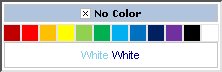

# Creating a Custom Skin

The following tutorial demonstrates creating a custom **RadColorPicker** skin, using the default skin as a base. This new skin will take the appearance of the color picker from its default look:

...to the following:
 

See [Understanding the Skin CSS File]() for more information on specific CSS file properties.

## Prepare the Project

1. In a new AJAX enabled application web form, add a **RadColorPicker**. Set the **EnabledEmbeddedSkins** property to **false**.

1. In the Solution Explorer, create a new "MySkin" folder in your project.

1. Copy the default RadColorPicker skin files from the installation directory to the "MySkin" directory; copy both the \ColorPicker directory that contains the images for this skin and the ColorPicker.Default.css file that defines the skin styles.

	>note The file path will typically be similar to this example: *\Program Files\Progress\UI for ASP.NET AJAX RX YYYY\Skins\Default.* 
	

1. The solution should now look something like the screenshot below:

	

1. In the Solution Explorer, rename "ColorPicker.Default.css" to "ColorPicker.MySkin.css".

	

## Edit the Skin CSS File

1. Open "ColorPicker.MySkin.css" for editing in Visual Studio.

1. Press **Control-H** to invoke the Find and Replace dialog.

1. Set **Find what:** to "_Default", **Replace with:** to "_MySkin", and **Look in:** to **Current Document**.

1. Click the **Replace All** button.

	

1. The style sheet should now look something like the example below.
 
	

1. From the Solution Explorer drag the "ColorPicker.MySkin.css" to the design surface of the form. This step will automatically add a reference to the page "`<head>`" tag as a "`<link>`" as shown in the screenshot below.

	

1. Change the **Skin** property of your RadColorPicker control to "MySkin".

1. Run the application. The new skin looks just like the Default skin:

	

## Edit the Skin CSS File

1. This walk-through demonstrates changing the border of the color picker to be slightly insert, the "No Color" area to be a light steel blue, and the light and dark text in the preview area to be SkyBlue and DarkBlue respectively. Before starting to modifying the style sheet, take a look at this abbreviated DOM-tree of **RadColorPicker**:

	__HTML__

			<table id="RadColorPicker1" class="radcolorpicker RadColorPicker_Default">
				<tr>
					<td>
						

							

								
							

							<ul>
								<li><a class="colorbox" /></li>
								...
							</ul>
							

								
							

						

					</td>
				</tr>
			</table>

1. The classes that control the appearance for border of the color picker are the ".RadColorPicker_MySkin" and ".palette" classes. Locate the ".RadColorPicker_MySkin .palette" CSS selector and set the border to have a 2 pixel insert.

	__CSS__

		.RadColorPicker_MySkin .palette
		{
			border: inset 2px #9c9c9c;
			background: #fff;
		} 

1. Change the color picker background by located the CSS selector ".RadColorPicker_MySkin .palette .emptycolor" and ".RadColorPicker_MySkin .palette .emptycolor.selectedColor". Change the background-color to be "LightSteelBlue".

	__CSS__

		.RadColorPicker_MySkin .palette .emptycolor, .RadColorPicker_MySkin .palette .emptycolor.selectedColor
		{
			background-color: LightSteelBlue;
			border: 1px solid #C5C5C5 !important;
			font-size: 12px;
			line-height: 30px;
			margin: 2px 2px 0pt;
			text-align: center;
		} 

1. Change the font color of preview window text to light blue and dark blue. Find the CSS selectors ".RadColorPicker_MySkin .palette .colorpreview .colorvaluedark", ".RadColorPicker_MySkin .palette .colorpreview .colorvaluelight" and change the Color property:

	__CSS__

		.RadColorPicker_MySkin .palette .colorpreview .colorvaluedark
		{
			color: SkyBlue;
			margin-right: 2px;
		}
		.RadColorPicker_MySkin .palette .colorpreview .colorvaluelight
		{
			color: DarkBlue;
			margin-left: 2px;
		} 

1. Press **F5** to run the application. Notice that both the border, "No Color" area color and preview text color has changed.

	

For more information about Cascading Style Sheets, see

* [World Wide Web Consortium CSS specifications](https://www.w3.org/Style/CSS/)

* [W3 Schools CSS tutorial](https://www.w3schools.com/css/default.asp)

* [Guide to Cascading Style Sheets](http://www.htmlhelp.com/reference/css/)

# See Also

 * [Controlling Appearance]()

 * [Understanding the Skin CSS File]()

 * [CSS Classes]()
