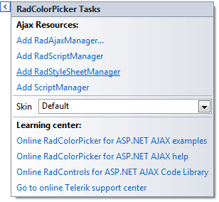

# Design Time

You can display the Smart Tag by right clicking on a **RadColorPicker** control and choosing "Show Smart Tag" or by clicking the small rightward pointing arrow at the upper right of the control.

## Ajax Resources

* **Add RadAjaxManager...** adds a **RadAjaxManager** component to your Web page.

* **Add RadScriptManager** adds a **RadScriptManager** component to your Web page.

* **Add RadStyleSheetManager** adds a **RadStyleSheetManager** component to your Web page.

* **Add ScriptManager** adds a **ScriptManager** component to your Web page.

## Skin

The **Skin** drop-down displays a list of available [skins]() that you can apply to your control, along with an example of what the **RadColorPicker** control looks like for each skin. Assign a skin by selecting the one you want from the list.

## Learning Center

Links navigate you directly to RadColorPicker examples, help, and code library.

# See Also

 * [Skins]()
