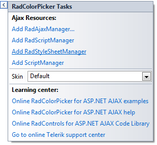

# Design Time

You can display the Smart Tag by right clicking on a __RadColorPicker__control and choosing "Show Smart Tag" or by clicking the small rightward pointing arrow at the upper right of the control.
>caption 

## Ajax Resources

* __Add RadAjaxManager...__ adds a __RadAjaxManager__ component to your Web page, and displays the __r.a.d.ajax Property Builder__ where you can configure it.

* __Add RadScriptManager__ adds a __RadScriptManager__ component to your Web page.

* __Add RadStyleSheetManager__ adds a __RadStyleSheetManager__ component to your Web page.

* __Add ScriptManager__ adds a __ScriptManager__ component to your Web page.

## Skin

The __Skin__ drop-down displays a list of available [skins]() that you can apply to your control, along with an example of what the __RadSplitter__ control looks like for each skin. Assign a skin by selecting the one you want from the list.

## Learning Center

Links navigate you directly to RadColorPicker examples, help, and code library.

# See Also

 * [Skins]()
