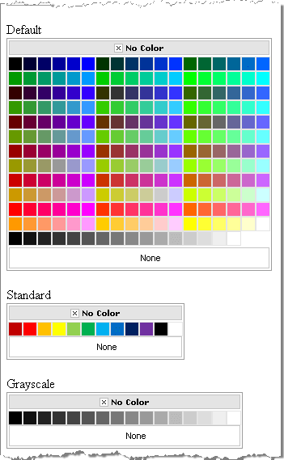

# Color Presets


There are a number of embedded palettes which can be used by setting the **Preset** property of the **RadColorPicker**. The available palettes are defined in the **ColorPreset** enumeration.




````C#
using System;
using System.Web.UI;
using System.Web.UI.HtmlControls;
using Telerik.Web.UI;
namespace ColorPicker
{
   public partial class _Default : System.Web.UI.Page
   {
       protected void Page_Load(object sender, EventArgs e)
       {
           foreach(ColorPreset preset in Enum.GetValues(typeof(ColorPreset)))
           {
               LiteralControl literal = new LiteralControl("<br>" + preset.ToString());  
               RadColorPicker radColorPicker = new RadColorPicker();
               radColorPicker.Preset = preset;
               this.Controls.Add(literal);
               this.Controls.Add(radColorPicker);
           }
       }
   }
} 
````
````VB.NET
Imports System
Imports System.Web.UI
Imports System.Web.UI.HtmlControls
Imports Telerik.Web.UI
Namespace ColorPicker
		Partial Public Class _Default
			Inherits System.Web.UI.Page
			Protected Sub Page_Load(ByVal sender As Object, ByVal e As EventArgs)
				For Each preset As ColorPreset In [Enum].GetValues(GetType(ColorPreset))
					Dim literal As New LiteralControl("<br>" + preset.ToString())
					Dim radColorPicker As New RadColorPicker()
					radColorPicker.Preset = preset
					Me.Controls.Add(literal)
					Me.Controls.Add(radColorPicker)
				Next
			End Sub
		End Class
	End Namespace
````


# See Also

 * [Defining Color Palettes]()
