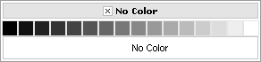
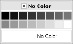

# Columns


Using the **Columns** property you can organize the colors in the palette so they are rendered in appropriate color groups. By default, setting a **Preset** will automatically set the appropriate **Columns** property value so that the preset palette is rendered correctly. If you have a custom color collection, you can arrange the colors by setting the appropriate **Columns** property value.

````ASP.NET
<telerik:RadColorPicker RenderMode="Lightweight" runat="server" ID="RadColorPicker1" Preset="Grayscale" />
````


Displays as:




````ASP.NET
<telerik:RadColorPicker RenderMode="Lightweight" runat="server" ID="RadColorPicker1" Preset="Grayscale" Columns="8"/> 
````


Displays as:




# See Also

 * [Width]()

 * [Color Presets]()

 * [Defining Color Palettes]()
