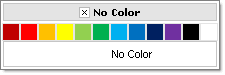
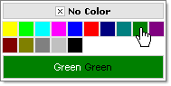
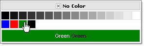
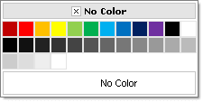

# Defining Color Palettes

1. Using the **Preset** property, a user can choose from a number of predefined (embedded) palettes. [See]() the available predefined palettes.

	__ASP.NET__

		<telerik:RadColorPicker ID="RadColorPicker1" runat="server" Preset="Standard" />
		

	The result is:
	
	

1. Defining the **Items collection** allows users to set their own colors in the color palette

	__ASP.NET__
	
		<telerik:RadColorPicker ID="RadColorPicker1" runat="server" Preset="none">
		   <telerik:ColorPickerItem Title="Yellow" Value="#FFFF00" />
		   <telerik:ColorPickerItem Title="Light Green" Value="#00FF00" />
		   <telerik:ColorPickerItem Title="Turquoise" Value="#00FFFF" />
		   <telerik:ColorPickerItem Title="Pink" Value="#FF00FF" />
		   <telerik:ColorPickerItem Title="Blue" Value="#0000FF" />
		   <telerik:ColorPickerItem Title="Red" Value="#FF0000" />
		   <telerik:ColorPickerItem Title="Dark Blue" Value="#000080" />
		   <telerik:ColorPickerItem Title="Teal" Value="#008080" />
		   <telerik:ColorPickerItem Title="Green" Value="#008000" />
		   <telerik:ColorPickerItem Title="Violet" Value="#800080" />
		   <telerik:ColorPickerItem Title="Dark Red" Value="#800000" />
		   <telerik:ColorPickerItem Title="Dark Yellow" Value="#808000" />
		   <telerik:ColorPickerItem Title="Gray - 50%" Value="#808080" />
		   <telerik:ColorPickerItem Title="Gray - 25%" Value="#C0C0C0" />
		   <telerik:ColorPickerItem Title="Black" Value="#000000" />
		</telerik:RadColorPicker> 

	The result is:
	
	

1. Using the **Preset** *and* the **Items** collection, you can extend the colors of a predefined palette by adding custom colors to an existing palette:

	__ASP.NET__

		<telerik:RadColorPicker ID="RadColorPicker1" runat="server" Preset="Grayscale">
		   <telerik:ColorPickerItem Title="Blue" Value="#0000FF" />
		   <telerik:ColorPickerItem Title="Red" Value="#FF0000" />
		   <telerik:ColorPickerItem Title="Green" Value="#008000" />
		   <telerik:ColorPickerItem Title="Black" Value="#000000" />
		</telerik:RadColorPicker> 

	The result is:
	
	

1. You can also combine preset palettes in the code-behind:

	__ASP.NET__
	     
		<telerik:RadColorPicker ID="RadColorPicker1" runat="server" />
		
	__C#__

			protected void Page_Load(object sender, EventArgs e)
			{
				RadColorPicker1.Columns = 12;
				RadColorPicker1.Items.AddRange(RadColorPicker1.GetStandardColors());
				RadColorPicker1.Items.AddRange(RadColorPicker1.GetGrayscaleColors());
			} 

	__VB__

			Protected Sub Page_Load(ByVal sender As Object, ByVal e As EventArgs)
				RadColorPicker1.Columns = 12
				RadColorPicker1.Items.AddRange(RadColorPicker1.GetStandardColors())
				RadColorPicker1.Items.AddRange(RadColorPicker1.GetGrayscaleColors())
			End Sub

	The result is:
	
	
