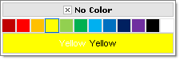
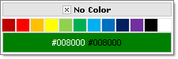

# Selecting a Color

To set the selected color of the palette use the **SelectedColor** property. This can be assigned on the client, in the code-behind or directly in the ASP.NET markup.

* In the ASP.NET markup, define the color as a color name or a hexadecimal as shown in the example below.

	__ASP.NET__
	     
		<telerik:RadColorPicker RenderMode="Lightweight" ID="RadColorPicker1" runat="server" Preset="standard" SelectedColor="#FFFF00" />

	Displays as:
	
	

* In code-behind use the **SelectedColor** property. The selected value is decorated with a different CSS class.

	__C#__
	     
		RadColorPicker1.SelectedColor = System.Drawing.Color.Green;

	__VB__
	     
		RadColorPicker1.SelectedColor = System.Drawing.Color.Green

	Displays as:
	
	

* When the **ShowIcon** property is set to **True** the **SelectedColor** will fill the icon.

	__C#__
	     
		RadColorPicker1.SelectedColor = System.Drawing.Color.Green;RadColorPicker1.ShowIcon = true;

	__VB__
	     
		RadColorPicker1.SelectedColor = System.Drawing.Color.Green;RadColorPicker1.ShowIcon = true;

	Displays as:
	
	

* You can also get/set the **SelectedColor** using the [client-side API](), with the **set_selectedColor(value)**, **get_selectedColor()** methods. To get the title of the selected color on the client you can use the **get_selecteColorTitle()** method. The value on the client-side is always in hexadecimal format.

# See Also

 * [Events]()
