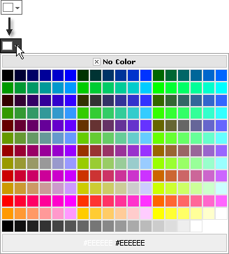
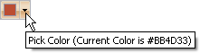

# Show as Icon


Use the **ShowIcon** property to display the color picker as an icon. When the user clicks on the icon, the color palette is displayed below the icon. This mode is well suited for scenarios where the color picker is placed on a tool bar.

````ASPNET
<telerik:RadColorPicker runat="server" ShowIcon="true"/> 
````


When the user clicks the icon, the palette is displayed:



## ToolTips

Text for the tooltip that appears when the mouse hovers over the icon is controlled by the **PickColorText**and **CurrentColorText**properties.


