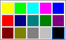

# Width


## 

The size of the color boxes in the palette is automatically calculated according to the __Columns__ property to fit the given __Width__ property. Each box is of equal width and height. By default, the size of each color box is __15__x __15__pixels. The example below shows two RadColorPicker definitions where both have 5 __Columns__, but the first uses the default width and the second has a __Width__ of 200 pixels.

````ASPNET
	<telerik:RadColorPicker
	   runat="server"
	   ID="RadColorPicker1"
	   SelectedColor="#000000"
	   ShowEmptyColor="false"
	   PreviewColor="false"
	   Columns="5"
	>
	   <telerik:ColorPickerItem Title="Yellow" Value="#FFFF00" />
	   <telerik:ColorPickerItem Title="Light Green" Value="#00FF00" />
	   <telerik:ColorPickerItem Title="Turquoise" Value="#00FFFF" />
	   <telerik:ColorPickerItem Title="Pink" Value="#FF00FF" />
	   <telerik:ColorPickerItem Title="Blue" Value="#0000FF" />
	   <telerik:ColorPickerItem Title="Red" Value="#FF0000" />
	   <telerik:ColorPickerItem Title="Dark Blue" Value="#000080" />
	   <telerik:ColorPickerItem Title="Teal" Value="#008080" />
	   <telerik:ColorPickerItem Title="Green" Value="#008000" />
	   <telerik:ColorPickerItem Title="Violet" Value="#800080" />
	   <telerik:ColorPickerItem Title="Dark Red" Value="#800000" />
	   <telerik:ColorPickerItem Title="Dark Yellow" Value="#808000" />
	   <telerik:ColorPickerItem Title="Gray - 50%" Value="#808080" />
	   <telerik:ColorPickerItem Title="Gray - 25%" Value="#C0C0C0" />
	   <telerik:ColorPickerItem Title="Black" Value="#000000" />
	</telerik:RadColorPicker> 
````


>caption 



````ASPNET
	<telerik:RadColorPicker
	   runat="server"
	   ID="RadColorPicker1"
	   SelectedColor="#000000"
	   ShowEmptyColor="false"
	   PreviewColor="false"
	   Columns="5"
	   Width="200px"
	>
	   <telerik:ColorPickerItem Title="Yellow" Value="#FFFF00" />
	   <telerik:ColorPickerItem Title="Light Green" Value="#00FF00" />
	   <telerik:ColorPickerItem Title="Turquoise" Value="#00FFFF" />
	   <telerik:ColorPickerItem Title="Pink" Value="#FF00FF" />
	   <telerik:ColorPickerItem Title="Blue" Value="#0000FF" />
	   <telerik:ColorPickerItem Title="Red" Value="#FF0000" />
	   <telerik:ColorPickerItem Title="Dark Blue" Value="#000080" />
	   <telerik:ColorPickerItem Title="Teal" Value="#008080" />
	   <telerik:ColorPickerItem Title="Green" Value="#008000" />
	   <telerik:ColorPickerItem Title="Violet" Value="#800080" />
	   <telerik:ColorPickerItem Title="Dark Red" Value="#800000" />
	   <telerik:ColorPickerItem Title="Dark Yellow" Value="#808000" />
	   <telerik:ColorPickerItem Title="Gray - 50%" Value="#808080" />
	   <telerik:ColorPickerItem Title="Gray - 25%" Value="#C0C0C0" />
	   <telerik:ColorPickerItem Title="Black" Value="#000000" />
	</telerik:RadColorPicker> 	
````


>caption 


# See Also

 * [Columns]()
