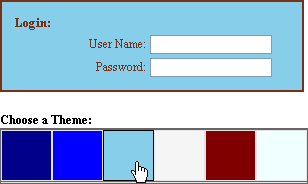

# Getting Started Overview

The following tutorial demonstrates how to use RadColorPicker to interact with the elements of a sample Login form. It shows how to configure the RadColorPicker and use it to change thecolor of the form.
 

1. In the default page of a new **ASP.NET AJAX-enabled Web Application** add the following ASP.NET markup. This will create the table containing the "Login" title, "Choose a Theme" title, labels and textboxes you see in the screenshot at the top of this topic. The markup will also contain CSS classes that will be defined later.

	__ASP.NET__

		<asp:Panel ID="Panel1" runat="server" BackColor="#E0E0E0" Width="300px" BorderStyle="Solid"
		   BorderWidth="2px">
		   <table class="MyTable">
		       <tr>
		           <td colspan="2">
		               <asp:Label ID="Label4" runat="server" Text="Login:" CssClass="MyTitle"></asp:Label>
		           </td>
		       </tr>
		       <tr>
		           <td>
		               <asp:Label ID="Label1" runat="server" Text="User Name:" CssClass="MyLabel"></asp:Label>
		           </td>
		           <td>
		               <asp:TextBox ID="TextBox1" runat="server" CssClass="MyTextBox"></asp:TextBox>
		           </td>
		       </tr>
		       <tr>
		           <td>
		               <asp:Label ID="Label2" runat="server" Text="Password:" CssClass="MyLabel"></asp:Label>
		           </td>
		           <td>
		               <asp:TextBox ID="TextBox2" runat="server" TextMode="Password" CssClass="MyTextBox"></asp:TextBox>
		           </td>
		       </tr>
		   </table>
		</asp:Panel>
		 
		<asp:Label ID="Label3" runat="server" CssClass="MyTitle" Text="Choose a Theme:"></asp:Label>  

1. To the `<head>` tag add these styles to format the title, labels and textboxes:

	__CSS__
		
		.MyTable
		{
		   margin: 10px;
		}
		.MyTitle
		{
		   float: left;
		   font-size: 13px;
		   font-weight: bold;
		}
		.MyLabel
		{
		   float: right;
		   font-size: 12px
		}
		.MyTextBox
		{
		   font-size: 12px;
		}

1. Add a [RadColorPicker]() control to the page.

1. Open the RadColorPicker [Smart Tag]() and select "Vista" from the **Skin** drop down list.

1. In the Properties Window set properties as shown below. *AutoPostBack will be true to allow the server events to fire when the user clicks a color box. PreViewColor and ShowEmptyColor will be false to show only the list of colors. Later, custom colors will be defined so Preset is set to None to eliminate the other colors.*

	1. AutoPostBack = True
	
	1. Preset = None
	
	1. PreviewColor = False
	
	1. ShowEmptyColor = False
	
	1. Height = "250px"
	
	1. Width = "500px"

1. In the ASP.NET markup for the color picker, add the ColorPickerItems shown below after the `<telerik:RadColorPicker>` tag. *Notice the __Title__ property that defines the ToolTip as the user hovers the mouse over a color while the __Value__ is set either to a named color or a hexadecimal value that describes the color.*

	__ASP.NET__

		<telerik:RadColorPicker
		   AutoPostBack="True"
		   ID="RadColorPicker1"
		   runat="server"
		   Preset="None"
		   PreviewColor="False"
		   ShowEmptyColor="False"
		   Skin="Vista"
		   Height="250px"
		   Width="500px">
		   <telerik:ColorPickerItem Title="Dark Blue" Value="DarkBlue" />
		   <telerik:ColorPickerItem Title="Blue" Value="Blue" />
		   <telerik:ColorPickerItem Title="Light Blue" Value="SkyBlue" />
		   <telerik:ColorPickerItem Title="WhiteSmoke" Value="whitesmoke" />
		   <telerik:ColorPickerItem Title="Maroon" Value="Maroon" />
		   <telerik:ColorPickerItem Title="Light Green" Value="Azure" />
		</telerik:RadColorPicker> 

1. In the Properties Window, click the Events button (). Double-click the [ColorChanged]() event to create an event handler. Replace the event handler with the code below.

	__C#__

		protected void RadColorPicker1_ColorChanged1(object sender, EventArgs e)
		{
			Panel1.BackColor = RadColorPicker1.SelectedColor;
			Label1.ForeColor = GetContrastingColor(RadColorPicker1.SelectedColor);
			Label2.ForeColor = GetContrastingColor(RadColorPicker1.SelectedColor);
			Label4.ForeColor = GetContrastingColor(RadColorPicker1.SelectedColor);
			Panel1.BorderColor = GetContrastingColor(RadColorPicker1.SelectedColor);
		} 

	__VB__

		Protected Sub RadColorPicker1_ColorChanged1(ByVal sender As Object, ByVal e As EventArgs)
			Panel1.BackColor = RadColorPicker1.SelectedColor
			Label1.ForeColor = GetContrastingColor(RadColorPicker1.SelectedColor)
			Label2.ForeColor = GetContrastingColor(RadColorPicker1.SelectedColor)
			Label4.ForeColor = GetContrastingColor(RadColorPicker1.SelectedColor)
			Panel1.BorderColor = GetContrastingColor(RadColorPicker1.SelectedColor)
		End Sub

1. Add the following helper method to get a contrasting color:

	__C#__

		private System.Drawing.Color GetContrastingColor(System.Drawing.Color backgroundColor)
		{
			return System.Drawing.Color.FromArgb(backgroundColor.ToArgb() ^ 0x00ffffff);
		} 	

	__VB__

		Private Function GetContrastingColor(ByVal backgroundColor As System.Drawing.Color) As System.Drawing.Color
			Return System.Drawing.Color.FromArgb(backgroundColor.ToArgb() Xor 16777215)
		End Function

1. Press **F5** to run the application. Click the color boxes and notice the contrasting colors for the labels, panel background and border.

# See Also

 * [Design Time]()

 * [Defining Color Palettes]()
