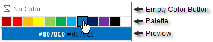

# Structure

The main visual elements of **RadColorPicker** are:
 

* **Empty Color Button**: This is shown if **ShowEmptyColor** is **False**. The user can click this to set "No Color" in the preview area.

* **Palette**: This is made up of color squares that the user can select with the mouse.

* **Preview**: The color square the mouse is currently hovered over displays in the preview area. The color may display as a color name or a hexadecimal string. The string describing the color is displayed in both light and dark colors for better visibility.

>note **RadColorPicker** displays as an icon only if **ShowIcon** is set to **True**.

# See Also

 * [Show as Icon]()
