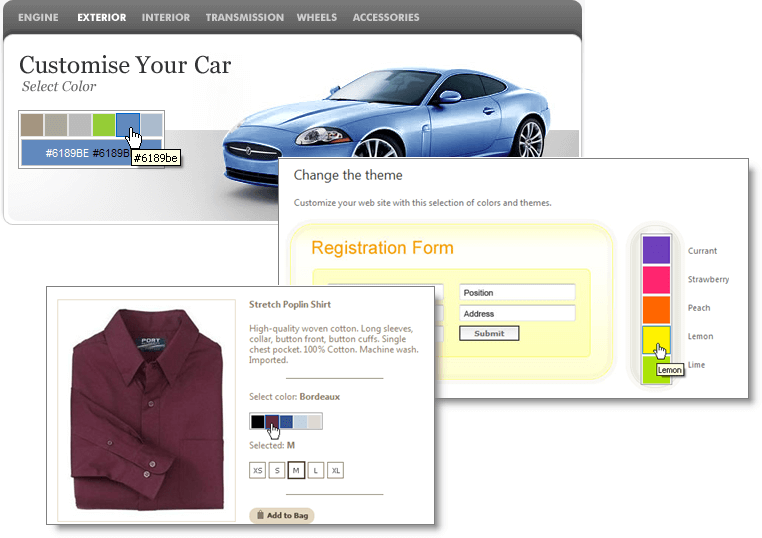
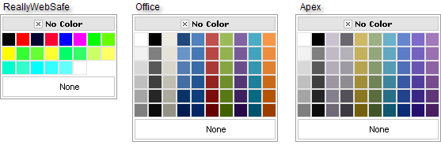
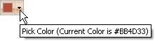
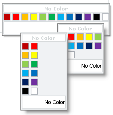

# RadColorPicker Overview

Telerik RadColorPicker for ASP.NET AJAX is a lightweight UI component that allows users to select colors from the RGB or HEX color spaces using a configurable palette view. The control is completely customizable in terms of appearance and offers numerous configuration options including:

1. [25 Preset Color Palettes]() To speed up your work RadColorPicker is shipped with 25 ready-to-use color palettes like Grayscale, Web216, ReallyWebSafe, Office, etc.

	

1. [Custom Color Palettes]() - you can easily define your custom color palette, as well as combine custom with preset palettes when necessary.

1. [Automatic Picker Button]() - RadColorPicker can render a picker button, which will open the color palette. The picker button will also display the currently selected color. Alternatively, the palette can be always visible or can be evoked using the client-side API.

	

1. "[No Color" and Color Preview Elements]() - depending on the particular settings, RadColorPicker can display a "No Color" button in the color palette. A color preview area displays the actual color and its hex code.

1. [Configurable Palette Layout]() - you can define the number of color columns to be displayed in the color palette or leave them to be configured automatically.

	

1. [Automatic color box sizing]() - the size of the color boxes in the palette is automatically calculated according to the Columns property to fit the given Width property. The boxes are of equal width and height. By default the size of each color box is 15px/15px

1. [Advanced Skinning]() - the visual appearance of the color palette can be easily customized through skins. You can use one of the predefined skins or create your own.

# See Also

 * [Defining Color Palettes]()

 * [Selecting a Color]()

 * [Color Presets]()

 * [Show as Icon]()

 * [Width]()

 * [Columns]()

 * [Hiding and Displaying Color Picker Elements]()

 * [Skins]()

 * [Controlling Appearance]()
