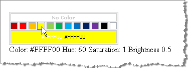

# Events


## 

The __RadColorPicker__control raises a single server-side event, __ColorChanged__that fires when the user changes the __SelectedColor__with the mouse or mouse wheel. Set the __AutoPostBack__ property __True__ to raise the event right after the color is changed on the client. Retrieve the __SelectedColor__property within the __ColorChanged__ event handler:
>caption 



>tabbedCode

````C#
		protected void RadColorPicker1_ColorChanged(object sender, EventArgs e)
		{
			string colorName = System.Drawing.ColorTranslator.ToHtml(RadColorPicker1.SelectedColor);
			Label1.Text = string.Format("Color: {0}  Hue: {1}  Saturation: {2}  Brightness {3}",
				colorName,
				RadColorPicker1.SelectedColor.GetHue(),
				RadColorPicker1.SelectedColor.GetSaturation(),
				RadColorPicker1.SelectedColor.GetBrightness());
		} 
````


````VB.NET
		Protected Sub RadColorPicker1_ColorChanged(ByVal sender As Object, ByVal e As EventArgs)
			Dim colorName As String = System.Drawing.ColorTranslator.ToHtml(RadColorPicker1.SelectedColor)
			Label1.Text = String.Format("Color: {0} Hue: {1} Saturation: {2} Brightness {3}", colorName, RadColorPicker1.SelectedColor.GetHue(), RadColorPicker1.SelectedColor.GetSaturation(), RadColorPicker1.SelectedColor.GetBrightness())
		End Sub
````


>end

# See Also

 * [Methods]()
