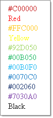

# Methods


## 

RadColorPicker has a number of methods that return [preset palette colors](), one method for each member of the __ColorPreset__ enumeration. Use these methods to return a collection of __ColorPickerItem.__The example below enumerates the collection returned by __GetStandardColors()__ method.
>caption 



>tabbedCode

````C#
	using System;
	using System.Web.UI;
	using System.Web.UI.HtmlControls;
	using System.Web.UI.WebControls;
	using Telerik.Web.UI;
	namespace ColorPicker
	{
	   public partial class _Default : System.Web.UI.Page
	   {
	       protected void Page_Load(object sender, EventArgs e)
	       {           
	            ColorPickerItemCollection items  = RadColorPicker1.GetStandardColors();
	            foreach (ColorPickerItem item in items)
	            {
	                Label label = new Label();
	                label.Text = item.Title;
	                label.ForeColor = item.Value;
	                this.Controls.Add(label);
	                this.Controls.Add(new LiteralControl("<br>"));
	            }                
	       }
	   }
	} 
````
````VB.NET
	Imports System
	Imports System.Web.UI
	Imports System.Web.UI.HtmlControls
	Imports System.Web.UI.WebControls
	Imports Telerik.Web.UI
	Namespace ColorPicker
			Partial Public Class _Default
				Inherits System.Web.UI.Page
				Protected Sub Page_Load(ByVal sender As Object, ByVal e As EventArgs)
					Dim items As ColorPickerItemCollection = RadColorPicker1.GetStandardColors()
					For Each item As ColorPickerItem In items
						Dim label As New Label()
						label.Text = item.Title
						label.ForeColor = item.Value
						Me.Controls.Add(label)
						Me.Controls.Add(New LiteralControl("<br>"))
					Next
				End Sub
			End Class
		End Namespace
````
>end

# See Also

 * [Events]()

 * [Color Presets]()
