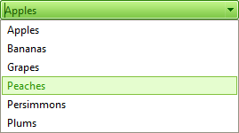
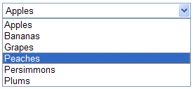

# Accessibility

As of 2008 Q3 release, RadComboBox introduces a new property - **AccessibilityMode.** When set to *True*, **`<noscript>`** tag containing **select** HTML element is rendered. This **select** will be displayed instead of RadComboBox if the JavaScript is **disabled**. Default value of the property is *False.*

All properties of RadComboBox that have their counterparts in the standard DropDown list (**select** element) will be propagated. The [SelectedIndexChanged]() event will fire accordingly on postback (submit).


>tip The **Height** property is not propagated to the **select** element because Firefox 3 treats it in a different way compared to IE 7.
>

Consider the following RadComboBox definition:

````ASPNET

<telerik:radcombobox id="RadComboBox1" runat="server" width="269px" skin="Hay" accessibilitymode="true"
	onselectedindexchanged="RadComboBox1_SelectedIndexChanged">    
    <Items>        
        <telerik:RadComboBoxItem runat="server" Text="Apples" Value="1" />        
        <telerik:RadComboBoxItem runat="server" Text="Bananas" Value="2" />        
        <telerik:RadComboBoxItem runat="server" Text="Grapes" Value="3" />        
        <telerik:RadComboBoxItem runat="server" Text="Peaches" Value="4" />        
        <telerik:RadComboBoxItem runat="server" Text="Persimmons" Value="5" />        
        <telerik:RadComboBoxItem runat="server" Text="Plums" Value="6" />    
    </Items>
</telerik:radcombobox>

````

If JavaScript is enabled on the page RadComboBox will look like:



If the JavaScript is **disabled**, a standard **select** element will be rendered having the same items and corresponding properties:



Here is the rendered HTML output:

````HTML
<div id="RadComboBox1" class="RadComboBox RadComboBox_Default" style="width: 269px; display: inline-block;">
    <table class="rcbFocused" style="border-width: 0pt; border-collapse: collapse;" summary="combobox">
        <tbody>
            <tr class="rcbReadOnly">
                <td class="rcbInputCell rcbInputCellLeft" style="width: 100%;">
                    <input id="RadComboBox1_Input" class="rcbInput" type="text" readonly="readonly" value="Apples" name="RadComboBox1" autocomplete="off">
                </td>
                <td class="rcbArrowCell rcbArrowCellRight">
                    <a id="RadComboBox1_Arrow" style="overflow: hidden; display: block; position: relative; outline: none;">select</a>
                </td>
            </tr>
        </tbody>
    </table>
    <input id="RadComboBox1_ClientState" type="hidden" name="RadComboBox1_ClientState"
        autocomplete="off" />
</div>
<div class="rcbSlide" style="z-index: 6000; visibility: visible; display: block; overflow: visible; margin-left: 0pt; position: absolute; top: 30px; left: 8px; height: 107px; width: 269px;">
    <div id="RadComboBox1_DropDown" class="RadComboBoxDropDown RadComboBoxDropDown_Default "
        style="display: block; visibility: visible; top: 0px; left: 0px; width: 267px;">
        <div class="rcbScroll rcbWidth" style="width: 100%; overflow: auto; height: 105px;">
            <ul class="rcbList" style="list-style: none; margin: 0; padding: 0; zoom: 1;">
                <li class="rcbItem ">Apples</li>
                <li class="rcbItem ">Grapes</li>
                <li class="rcbItem ">Peaches</li>
                <li class="rcbItem ">Persimmons</li>
                <li class="rcbHovered ">Plums</li>
            </ul>
        </div>
    </div>
</div>
<noscript>
    <div style="display: inline;">
        <select name="ComboBox_RadComboBox1" id="ComboBox_RadComboBox1" style="width: 269px;">
            <option selected="selected" value="">Apples</option>
            <option value="">Grapes</option>
            <option value="">Peaches</option>
            <option value="">Persimmons</option>
            <option value="">Plums</option>
        </select>
    </div>
</noscript>
````

## See Also

[Rendering]()

