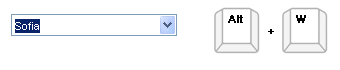
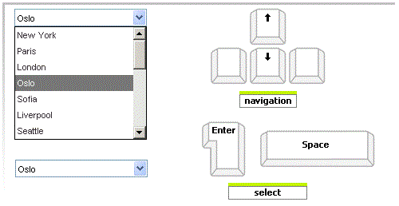
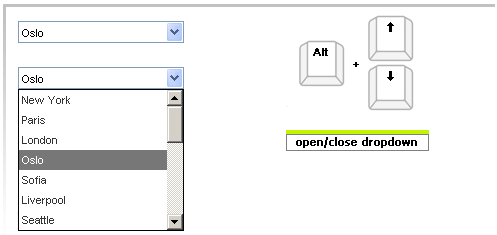

# Keyboard Support


## 

__RadCombobox__ provides support for the two relevant aspects of keyboard support:

* __Access Keys__ - You can specify a key that lets the end-user move focus directly to the combobox. Once focus is on the combobox, the user can use the arrow keys for navigation. The access key is defined using the __AccessKey__ property. For example, if you set the __AccessKey__ property to "W", focus moves to the combobox when the user types "Alt+W".

````ASPNET
	     
							<telerik:RadComboBox runat="server" AccessKey="W" ... />
				
````



* __Key Navigation__- RadComboBox allows end-users to navigate the combobox structure using the arrow keys and the Space and Enter keys:

* The up and down arrow keys change the current item in the drop-down list, updating the input area with the next item in the corresponding direction.

* The "Alt + Up" and "Alt+Down" arrows open and close the drop-down list.

* The "Enter" key selects the current item in the list.

* __ChangeTextOnKeyBoardNavigation__ boolean property determines whether combobox will change its text in the input area when you scroll down the items with the keyboard.

See live example at [Keyboard Support](http://www.telerik.com/DEMOS/ASPNET/prometheus/ComboBox/Examples/Functionality/KeyboardSupport/DefaultCS.aspx)

# See Also

 * [OnClientKeyPressing]()
