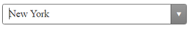
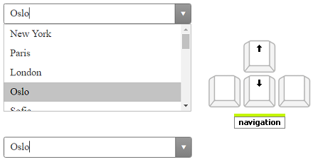

# Keyboard Support

A critical requirement for software accessibility is keyboard support as a complete alternative to pointing devices (mouse, etc.).

Keyboard support is comprised of command key, focus key, and keyboard navigation. RadComoboBox will seamlessly switch between mouse and keyboard navigation.

Setting the control's **KeyboardNavigationSettings** (*introduced in R2 2016 - ver.2016.2.504*), allows you to associate an activation combination (**CommandKey** + **FocusKey**), which moves focus directly to the **RadComboBox** and enables keyboard navigation.

>note Certain keyboard combinations are reserved and used as shortcuts in the browsers.
>

**Example:** Setting the **KeyboardNavigationSettings** for **RadComboBox**

````ASPNET
<telerik:RadComboBox ID="RadComboBox1" runat="server" >
    <KeyboardNavigationSettings CommandKey="Alt" FocusKey="M" />
</telerik:RadComboBox>
````

## Keyboard Navigation

* Focus the **RadComboBox** by pressing **CommandKey** + **FocusKey**:



* Press **Alt** + **Down Arrow** to expand the dropdown.


* Navigate the items using **Up** and **Down Arrow** keys:



* Press **Alt** + **Up Arrow** or "Esc" to close the dropdown.

   

* Press **Enter** to select an Item.

   

# See Also

 * [Keyboard Support Demo](https://demos.telerik.com/aspnet-ajax/combobox/examples/functionality/keyboardsupport/defaultcs.aspx)
