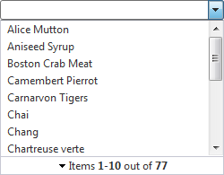
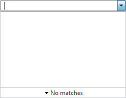
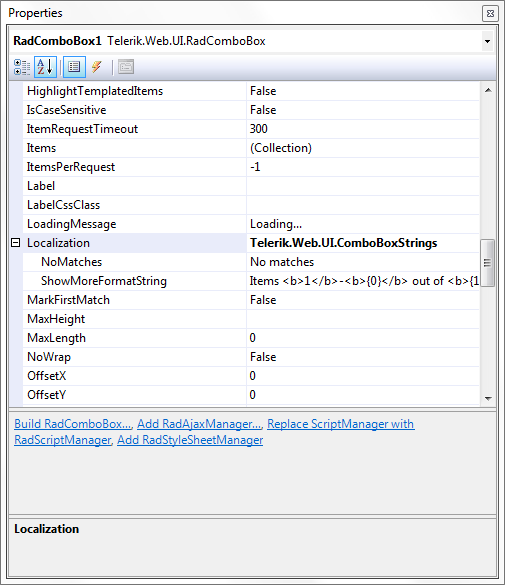
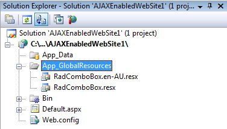
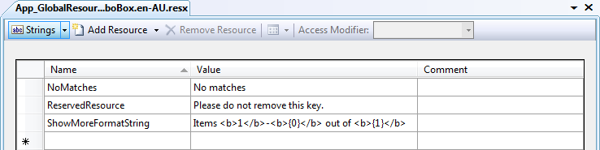
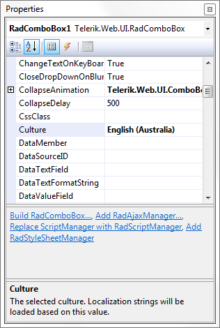

# Localization


The localization support for RadComboBox lets you translate the control’s strings that appear in the ‘Show More Results’ box in [Load On Demand]() configurations when the **ShowMoreResultsBox** property is set to *True*.






## Localization property

By changing the values of each of its named sub-properties, you change the appearance of the respective strings:

````ASPNET
<telerik:radcombobox id="RadComboBox1" runat="server" 
	localization-nomatches="No matches"
	localization-showmoreformatstring="Items <b>1</b>-<b>{0}</b> out of <b>{1}</b>" />
````





````C#
	     
RadComboBox1.Localization.NoMatches = "No matches";
RadComboBox1.Localization.ShowMoreFormatString = "Items <b>1</b>-<b>{0}</b> out of <b>{1}</b>";
				
````
````VB.NET
	     
RadComboBox1.Localization.NoMatches = "No matches"
RadComboBox1.Localization.ShowMoreFormatString = "Items <b>1</b>-<b>{0}</b> out of <b>{1}</b>"
				
````


>note This technique is useful when customizing some of the messages of a **particular instance** . The messages are not shared between RadComboBox instances. A complete translation using this approach is inappropriate.
>


|  **Key**  |  **Value**  |  **Description**  |
| ------ | ------ | ------ |
|NoMatches|"No matches"|The text that shows when no Items are returned by the last request for Items.|
|ShowMoreFormatString|“Items `<b>1</b>-<b>{0}</b>` out of `<b>{1}</b>`”|The text that is formatted on the server to indicate how many Items have been loaded so far and the total number of Items matching the currently typed text.|

## Global Resource files

The primary means for localization in ASP.NET is to use **resource files**. Resource files are simple XML files that can be easily edited and transferred to other applications. You can use resource files to change the default (English) localization for RadComboBox that is stored in the Telerik.Web.UI assembly.

Follow these steps to create a global resource file to localize the RadComboBox:

1. Create the **App_GlobalResources** folder in the root of your Web Application.

2. Copy the default resource **RadComboBox.resx** file into it. This file can be found in the **App_GlobalResources** folder of the directory where you installed RadControls for ASP.NET AJAX.

3. Make a copy of the file and rename the copy so that its name contains the **Culture Identifier**. The resource files used by RadComboBox follow a strict naming convention: RadComboBox.<Culture Identifier>.resx

	>note The Culture Identifier consists of a language code followed by a dash and the country code. Example: “en-US”, “fr-CA” and so on.
	>


	For example, add the **RadComboBox.en-AU.resx** file to the App_GlobalResources folder (both localization files should be present there):

	


4. Edit the strings using the Visual Studio editor or your favorite text editor. Customize strings just as you would set the Localization property.



>caution Make sure that the **ReservedResource** entry is preserved. It is used for identification purposes and is never displayed.
>


You can now switch the resource file RadComboBox uses with the new one:


