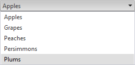

# Rendering


## 

RadComboBox renders DIVs, thereby saving HTML Output. For example, consider the following RadComboBox declaration:

````ASPNET
<telerik:radcombobox id="RadComboBox1" runat="server" width="269px">  
	<Items>     
		<telerik:RadComboBoxItem runat="server" Text="Apples"/>     
		<telerik:RadComboBoxItem runat="server" Text="Grapes"/>     
		<telerik:RadComboBoxItem runat="server" Text="Peaches"/>     
		<telerik:RadComboBoxItem runat="server" Text="Persimmons"/>     
		<telerik:RadComboBoxItem runat="server" Text="Plums"/>  
	</Items>
</telerik:radcombobox>
````




The rendered output for the RadComboBox defined, is as follows:

````ASPNET
<div id="RadComboBox1" class="RadComboBox RadComboBox_Default" style="width: 269px;">
	<table class="rcbFocused" style="border-width: 0pt; border-collapse: collapse;" summary="combobox">
		<tbody>
			<tr class="rcbReadOnly">
				<td class="rcbInputCell rcbInputCellLeft" style="width: 100%;">
					<input id="Text1" class="rcbInput" type="text" readonly="readonly" value="Apples"
						name="RadComboBox1" autocomplete="off">
				</td>
				<td class="rcbArrowCell rcbArrowCellRight">
					<a id="A1" style="overflow: hidden; display: block; position: relative;
						outline: none;">select</a>
				</td>
			</tr>
		</tbody>
	</table>
	<input id="RadComboBox1_ClientState" type="hidden" name="RadComboBox1_ClientState"
		autocomplete="off"/>
</div>
<div class="rcbSlide" style="z-index: 6000; visibility: visible; display: block;
	overflow: visible; margin-left: 0pt; position: absolute; top: 30px; left: 8px;
	height: 107px; width: 269px;">
	<div id="RadComboBox1_DropDown" class="RadComboBoxDropDown RadComboBoxDropDown_Default "
		style="display: block; visibility: visible; top: 0px; left: 0px; width: 267px;">
		<div class="rcbScroll rcbWidth" style="width: 100%; overflow: auto; height: 105px;">
			<ul class="rcbList" style="list-style: none; margin: 0; padding: 0; zoom: 1;">
				<li class="rcbItem ">Apples</li>
				<li class="rcbItem ">Grapes</li>
				<li class="rcbItem ">Peaches</li>
				<li class="rcbItem ">Persimmons</li>
				<li class="rcbHovered ">Plums</li>
			</ul>
		</div>
	</div>
</div>
````


As of 2008 Q3 release, RadComboBox has a new property - **AccessibilityMode**. By default it is set to *False*. If it is set to *True* **`<noscript>`** tag containing **`<select>`** HTML element will be rendered. This **select** will be displayed instead of RadComboBox if the javascript is disabled.

Here is the HTML output if you set the **AccessibilityMode** property to *True* in the above example:

````ASPNET
<div id="RadComboBox1" class="RadComboBox RadComboBox_Default" style="width: 269px; display: inline-block;">
	<table class="rcbFocused" style="border-width: 0pt; border-collapse: collapse;" summary="combobox">
		<tbody>
			<tr class="rcbReadOnly">
				<td class="rcbInputCell rcbInputCellLeft" style="width:100%;">
					<input id="RadComboBox1_Input" class="rcbInput" type="text" readonly="readonly" value="Apples" name="RadComboBox1" autocomplete="off">
				</td>
				<td class="rcbArrowCell rcbArrowCellRight">
					<a id="RadComboBox1_Arrow" style="overflow: hidden;display: block;position: relative;outline: none;">select</a>
				</td>
			</tr>
		</tbody>
	</table>
	<input id="RadComboBox1_ClientState" type="hidden" name="RadComboBox1_ClientState"
		autocomplete="off"/>
</div>
<div class="rcbSlide" style="z-index: 6000; visibility: visible; display: block;
	overflow: visible; margin-left: 0pt; position: absolute; top: 30px; left: 8px;
	height: 107px; width: 269px;">
	<div id="RadComboBox1_DropDown" class="RadComboBoxDropDown RadComboBoxDropDown_Default "
		style="display: block; visibility: visible; top: 0px; left: 0px; width: 267px;">
		<div class="rcbScroll rcbWidth" style="width: 100%; overflow: auto; height: 105px;">
			<ul class="rcbList" style="list-style: none; margin: 0; padding: 0; zoom: 1;">
				<li class="rcbItem ">Apples</li>
				<li class="rcbItem ">Grapes</li>
				<li class="rcbItem ">Peaches</li>
				<li class="rcbItem ">Persimmons</li>
				<li class="rcbHovered ">Plums</li>
			</ul>
		</div>
	</div>
</div>
<noscript>
	<div style="display: inline;">
		<select name="ComboBox_RadComboBox1" id="ComboBox_RadComboBox1" style="width: 269px;">
			<option selected="selected" value="">Apples</option>
			<option value="">Grapes</option>
			<option value="">Peaches</option>
			<option value="">Persimmons</option>
			<option value="">Plums</option>
		</select>
	</div>
</noscript>
````


