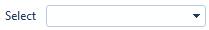
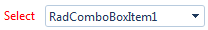

# Adding a Label


## 

As of __Q1 2010 release__, it is easy to attach a label to RadComboBox control: simply set the text of the label as the value of the __Label__ property. The label automatically appears to the left of the input area:



The look of the label text is determined by the [Skin]() property of the RadComboBox control. When you set the Skin property, the __LabelCssClass__ property is automatically set to "rcbLabel". This value is the CSS style that the skin applies to the label. You can substitute your own CSS class to change the appearance of the label by setting the __LabelCssClass__ property.

This is shown in the following example:

````ASPNET
	    <style type="text/css">
	        .myLabelCss
	        {
	            color: Red;
	        }
	    </style>
````


````ASPNET
	    <telerik:radcombobox 
	        id="test" 
	        runat="server"
	        label="Select" 
	        labelcssclass="myLabelCss">    
	        <Items>        
	            <telerik:RadComboBoxItem runat="server" Text="RadComboBoxItem1" Value="RadComboBoxItem1" />        
	            <telerik:RadComboBoxItem runat="server" Text="RadComboBoxItem2" Value="RadComboBoxItem2" />        
	            <telerik:RadComboBoxItem runat="server" Text="RadComboBoxItem3" Value="RadComboBoxItem3" />    
	        </Items>
	    </telerik:radcombobox>
````


And the result is:


