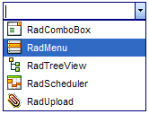

# Adding Images to Items


As of Q2 2008, **RadComboBox** introduces two new properties of RadComboBoxItem class: **ImageUrl** and **DisabledImageUrl**.

You can set the **ImageUrl** to point to an image which will be displayed on the left of the item's text in the dropdown.

You can set the **DisabledImageUrl** to point to an image which will be displayed on the left of the item's text in the dropdown when the item is disabled. Thus, you can have different images for the enabled and disabled state of an item.

>note Images are shown only in the dropdown and not in the input area of the combobox
>


## Working with ImageUrl and DisabledImageUrl in-line

````ASPNET
<telerik:radcombobox 
id="RadComboBox3" 
runat="server" 
skin="Outlook" 
allowcustomtext="true">    
<Items>        
	<telerik:RadComboBoxItem ImageUrl="Img/ComboboxPr.gif" Text="RadComboBox" runat="server">        
	</telerik:RadComboBoxItem>        
	<telerik:RadComboBoxItem ImageUrl="Img/MenuPr.gif" Text="RadMenu" runat="server">        
	</telerik:RadComboBoxItem>        
	<telerik:RadComboBoxItem ImageUrl="Img/TreeviewPr.gif" Text="RadTreeView" runat="server">        
	</telerik:RadComboBoxItem>        
	<telerik:RadComboBoxItem ImageUrl="Img/SchedulerPr.gif" Text="RadScheduler">        
	</telerik:RadComboBoxItem>        
	<telerik:RadComboBoxItem ImageUrl="Img/UploadPr.gif" Text="RadUpload">        
	</telerik:RadComboBoxItem>    
</Items>
</telerik:radcombobox>
````


The result is:



## Working with ImageUrl and DisabledImageUrl server-side

You can easily set the ImageUrl and DisabledImageUrl in the code-behind


````C#
	     
	
RadComboBox1.FindItemByText("RadMenu").ImageUrl = "Img/MenuPr.gif";
RadComboBox1.FindItemByText("RadMenu").DisabledImageUrl = "Img/MenuPrDisabled.gif";
				
````
````VB.NET
	
	
RadComboBox1.FindItemByText("RadMenu").ImageUrl = "Img/MenuPr.gif"
RadComboBox1.FindItemByText("RadMenu").DisabledImageUrl = "Img/MenuPrDisabled.gif"
				
````


## Working with ImageUrl and DisabledImageUrl client-side

To get the ImageUrl of an item - call the **get_imageUrl()** method.

To set the ImageUrl property - call the **set_imageUrl(url)** method.

To get the DisabledImageUrl of an item - call the **get_disabledImageUrl()** method.

To set the DisabledImageUrl property - call the **set_disabledImageUrl(url)** method.

## Controlling the visual appearance of the image

To control the appearance of the image element of the items you can change these CSS rules:

````ASPNET
div.RadComboBoxDropDown_Outlook .rcbImage
{ 
	vertical-align: middle; margin: 0 6px 2px 0;
}
````


Note that here the Outlook is the name of the Skin of the combobox. You need to change it with the name of the skin that you use.
