# Change the Height of the Input Element

This page contains information about RadComboBox for ASP.NET Ajax version **2009.1.311 and later.** using Classic render mode. If you are using any previous version of the controls please check [this article]().

## Changing the height of the input element in Lightweight render mode

If the RadComboBox' render mode is set to Lightweight (available since Q1 2013), the height of its input element can be easily set with the following CSS rule:

````CSS
html .RadComboBox .rcbInput {
    height: 25px ;
}
````

Unlike Lightweight, in which no sprite images are used, the Classic render mode does make use of them so changing the input's height would require the sprite images to be edited. The next sections explain how this can be achieved with a RadComboBox using Classic render mode. 

## Getting Started

* Declare the following exemplary RadComboBox on your page:

````ASPNET
<telerik:RadComboBox runat="server" ID="RadComboBox1">    
	<Items>        
		<telerik:RadComboBoxItem Text="Alpha" />        
		<telerik:RadComboBoxItem Text="Vita" />        
		<telerik:RadComboBoxItem Text="Ghamma" />        
		<telerik:RadComboBoxItem Text="Epsilon" />        
		<telerik:RadComboBoxItem Text="Zeta" />        
		<telerik:RadComboBoxItem Text="Eta" />        
		<telerik:RadComboBoxItem Text="Theta" />        
		<telerik:RadComboBoxItem Text="Iota" />       
		<telerik:RadComboBoxItem Text="Kappa" />        
		<telerik:RadComboBoxItem Text="Lambda" />    
	</Items>
</telerik:RadComboBox>
````

* As a base we will use the built-in Office2007 skin. From this location: `<RadControls install folder>`\Skins\Office2007\ copy the file **ComboBox.Office2007.css** and the folder ComboBox, create a Skins folder in your project, create a sub-folder named **50pxOffice2007** and paste them in it. Modify your RadComboBox declaration as shown below, in order to disable the embedded skin:

````ASPNET
<telerik:RadComboBox 
    runat="server" 
    Skin="Office2007" 
    EnableEmbeddedSkins="false" 
    ID="RadComboBox">
</telerik:RadComboBox>
````

* Add a link to the CSS file in the head tag:

````ASPNET
<link href="Skins/50pxOffice2007/ComboBox.Office2007.css" rel="stylesheet" type="text/css" />
````

Check if the RadComboBox is rendered properly - its skin should look like the built-in Office2007 skin.

## Renaming the Custom Skin

Instead of using the name of the built-in skin you can rename it. In this example the skin will be called **50pxOffice2007**. 

* Rename your skin CSS file to ComboBox.50pxOffice2007.css:

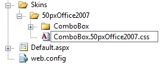

* The link to the CSS file has to be changed accordingly:

````ASPNET
<link href="Skins/50pxOffice2007/ComboBox.50pxOffice2007.css" rel="stylesheet" type="text/css" />
````

The actual name of the CSS file can differ from the skin name, but it is a good practice both to have the same name. 

* Open the CSS file and invoke the Find&Replace tool with Ctrl+H or Edit `->` Find and Replace `->` Quick Replace. Replace all occurrences of **_Office2007** with **_50pxOffice2007** in the CSS file:

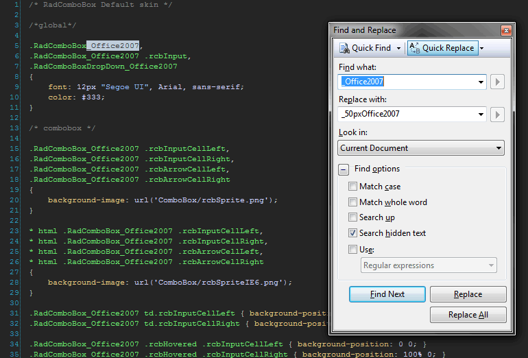

Save the file. 

* Change the RadComboBox skin name accordingly:

````ASPNET
<telerik:RadComboBox 
	runat="server" 
	Skin="50pxOffice2007" 
	EnableEmbeddedSkins="false"
	ID="RadComboBox">
</telerik:RadComboBox>
````

After these steps the skin should render as the built-in one we used as a base.

## Resizing the Sprite Images

* Launch your image editor (in this example we will use Adobe Photoshop) and open the **rcbSprite.png** (not the IE6 one – It is 8bit indexed alpha). 

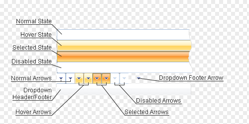

As you can see, the top four rows are for the four RadComboBox state backgrounds, while the fifth row contains only the dropdown arrow backgrounds. The rest of the sprite is used for styling the dropdown header and footer. 

* We need to resize the state and the arrow backgrounds to 50px height. To be able to do that, first we will need to resize the RadComboBox sprite image canvas to fit the expanding contents. Use Image `->` Canvas Size or Ctrl+Alt+C and enter 300px for height (5x50+what remains for the header). Align the contents to the top. Next, drag some guides from the top ruler and place them in 50px intervals starting from the first 50px. Then one by one cut the different states and the header (select one state with the Selection tool, create new Layer via Cut with the context menu and drag it to its new place) and place them under every guide until it looks like this:

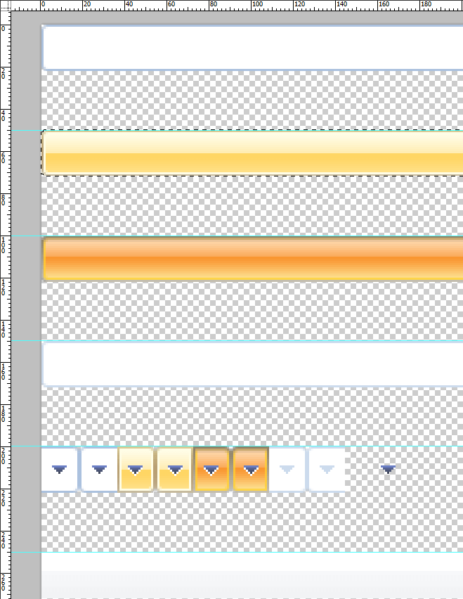

The next step is resizing the state sprites.

* After placing the states at their proper places, they need to be resized carefully in order to preserve the gradients as much as possible. To do that we will need a scaling algorithm different than Nearest Neighbor – go to Edit `->` Preferences `->` General `->` Image Interpolation and choose Bicubic or Bicubic Smoother. Press OK. Now use the Selection tool to select the bottom half of the Normal state then hold Ctrl and drag it until you reach the bottom guide with the bottom edge of the selection. The result should be similar to the following:

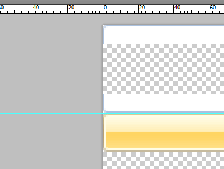

* Select one or several pixels high line closer to the inner edges, change to the Move tool (with V) and scale the selection upwards (or downwards depending on where you selected) until you get this:

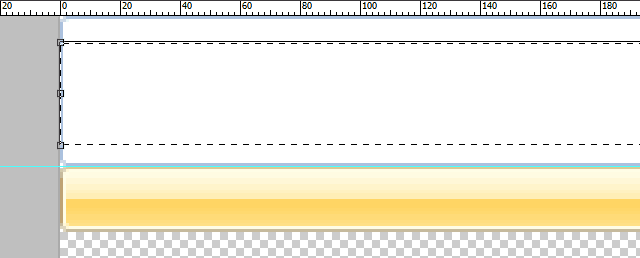

* Split the second sprite right in the middle – select from the half to the bottom edge, separating the light from the dark colors, hold Ctrl and drag to the bottom guide.

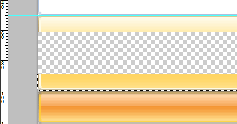

* Drag a new guide in the middle of the empty space (at exactly 75px), like this:

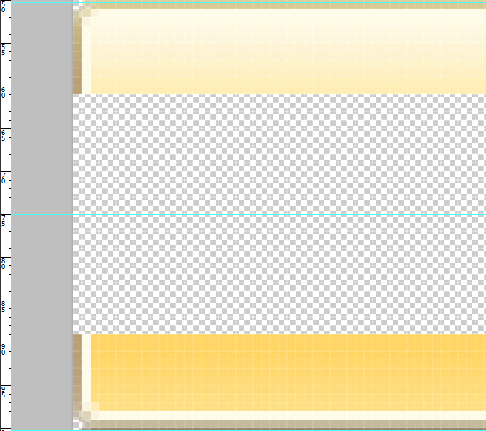

* Next, carefully select the bottom part of the sprite from the top edge to 3px above the bottom one, leaving the bottom edge and the corner transparency intact. Your selection should look like this:

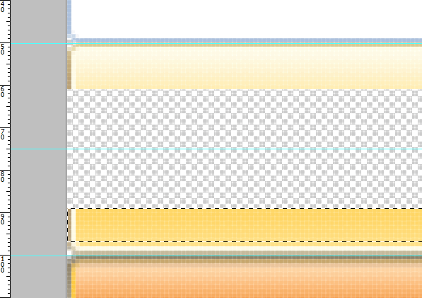

* Scale it to the middle:

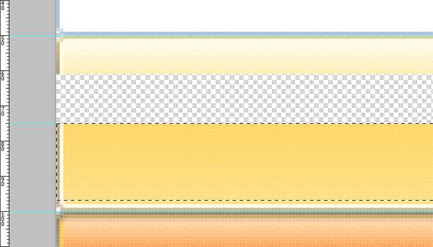

* Do the same to the top part of the sprite:

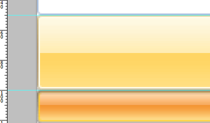

* Repeat for the rest of the states until you get to the arrows.

## Resizing the Arrow Ends

* With all the states ready, the next step is to resize the arrow ends. This task is more complicated since the arrow is part of the background. So, in order to resize them, we will need first to separate the arrows from the background. To do so we will use a Magic Wand (tool – activated with W). Adjust some of the tool properties – set the Tolerance to 110, switch off Anti-alias, but leave Contiguous on. Now select the arrows one by one, excluding the disabled two – we’ll need to change the tolerance to 20 before doing so. Also add to the selection the white arrow pixels in the hover and selected states. Most skins probably won’t require using tolerance and additional pixels, but for demonstration purposes we have selected one that requires them. After you finish selecting, get the context menu up and do a Layer via Cut:

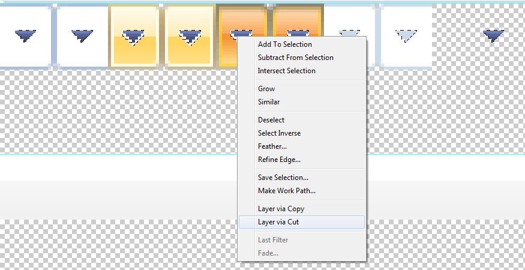

* After cutting the arrows, hide the new layer and you can resize the states as before. There is one detail though – every state now will have a hole in the middle. Fill it up before you start resizing – either with copy and paste, with the Stamp tool or by using select and duplicate (Ctrl + Alt + drag selection). Show the hidden arrows in the end and move their layer to the middle. You should get something like this in the end:

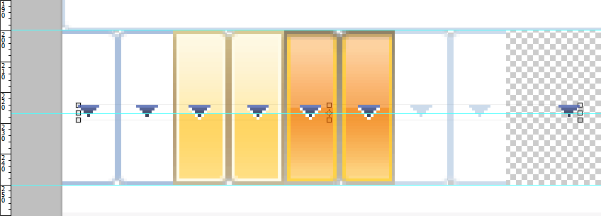


## Saving the Customized Sprite Images

* With the sprite image ready, we should replace the existing ones in the custom skin we prepared. Open Save for Web and Devices dialog and use the following options to save **rcbSprite.png**:

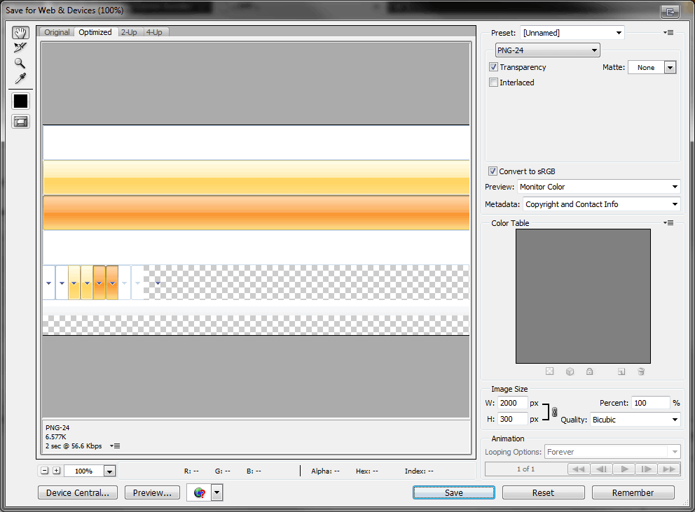

* Note that we are using **24bit PNG with alpha transparency** here. Replace the rcbSprite.png file which you’ve opened in the beginning. Since IE6 doesn’t support the alpha transparency of 24bit PNGs (rendering it completely opaque), we will need a second sprite image only for this browser. Bring up again Save for Web and Devices but use these options this time:

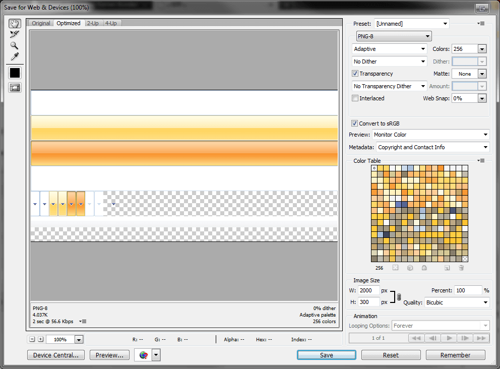

* Make sure **Matte** is set to **None**, otherwise index transparency on the state corners will be lost. Hit Save and replace the **rcbSpriteIE6.png** file in the same folder.

## Customizing CSS

* With the sprite images ready, the skin CSS has to be customized to support the new sprite height. Switch to your editor and open the CSS file. First thing to do is to override the default height and line-height of the Office2007 RadComboBox. Add this CSS rule in your CSS file, for example at the end:

````CSS
div.RadComboBox_50pxOffice2007 table td.rcbInputCell
{ 
    height: 50px; 
    line-height:50px;
}
````

Note the element type in front of the first class – it is used to **raise the specificity** so that we can override the base stylesheet selectors (the baseStyleSheet was added in Q3 2009 release). More information about specificity is available in the following article:[Smashing Magazine](http://www.smashingmagazine.com/2007/07/27/css-specificity-things-you-should-know/). 

* Now that we have RadComboBox height, we should change the background-positions of the four states. Find the lines below in the file (note that the line numbers below can change in next releases - these are based on the Q2 2009 Office2007 skin) and change them accordingly to the sprite image background positions - from divisible by 22, to divisible by 50:

Around lines 40-44:

````CSS
.RadComboBox_50pxOffice2007 .rcbHovered .rcbReadOnly td.rcbInputCellLeft 
{ 
    background-position: 0 -50px; 
}

.RadComboBox_50pxOffice2007 .rcbHovered .rcbReadOnly td.rcbInputCellRight
{ 
    background-position: 100% -50px; 
} 

.RadComboBox_50pxOffice2007 .rcbFocused .rcbReadOnly td.rcbInputCellLeft 
{ 
    background-position: 0 -100px; 
}

.RadComboBox_50pxOffice2007 .rcbFocused .rcbReadOnly td.rcbInputCellRight 
{ 
    background-position: 100% -100px;
}
````

Around lines 56-85:

````CSS
.RadComboBox_50pxOffice2007 td.rcbArrowCellLeft { background-position: -18px -200px; }
.RadComboBox_50pxOffice2007 td.rcbArrowCellRight { background-position: 0 -200px; }
.RadComboBox_50pxOffice2007 .rcbHovered .rcbArrowCellLeft { background-position: -54px -200px; }
.RadComboBox_50pxOffice2007 .rcbHovered .rcbArrowCellRight { background-position: -36px -200px; }
.RadComboBox_50pxOffice2007 .rcbFocused .rcbArrowCellLeft { background-position: -90px -200px; }
.RadComboBox_50pxOffice2007 .rcbFocused .rcbArrowCellRight { background-position: -72px -200px; }
.RadComboBox_50pxOffice2007 td.rcbArrowCellHidden,
.RadComboBox_50pxOffice2007 .rcbHovered td.rcbArrowCellHidden,
.RadComboBox_50pxOffice2007 .rcbFocused td.rcbArrowCellHidden { background-position: -15px -200px; }
/* Read-only styles */
.RadComboBox_50pxOffice2007 .rcbHovered .rcbReadOnly td.rcbArrowCellHidden { background-position: -51px -200px; }
.RadComboBox_50pxOffice2007 .rcbFocused .rcbReadOnly td.rcbArrowCellHidden { background-position: -87px -200px; }
.RadComboBox_50pxOffice2007 .rcbReadOnly td.rcbArrowCellLeft { background-position: -18px -200px; }
.RadComboBox_50pxOffice2007 .rcbReadOnly td.rcbArrowCellRight { background-position: -2px -200px; }
.RadComboBox_50pxOffice2007 .rcbHovered .rcbReadOnly .rcbArrowCellLeft { background-position: -54px -200px; }
.RadComboBox_50pxOffice2007 .rcbHovered .rcbReadOnly .rcbArrowCellRight { background-position: -38px -200px; }
.RadComboBox_50pxOffice2007 .rcbFocused .rcbReadOnly .rcbArrowCellLeft { background-position: -90px -200px; }
.RadComboBox_50pxOffice2007 .rcbFocused .rcbReadOnly .rcbArrowCellRight { background-position: -74px -200px; }
.RadComboBox_50pxOffice2007 .rcbReadOnly td.rcbArrowCellHidden { background-position: -15px -200px; }
.RadComboBox_50pxOffice2007 .rcbHovered .rcbReadOnly td.rcbArrowCellHidden { background-position: -51px -200px; }
.RadComboBox_50pxOffice2007 .rcbFocused .rcbReadOnly td.rcbArrowCellHidden { background-position: -87px -200px; }
Around line 114:
.RadComboBoxDropDown_50pxOffice2007 .rcbHeader,
.RadComboBoxDropDown_50pxOffice2007 .rcbFooter
{
background-color: #f1f2f4;
background-position: 0 -250px;
}
````

Around lines 150-156:

````CSS
.RadComboBox_50pxOffice2007 .rcbDisabled td.rcbInputCellLeft { background-position: 0 -150px; }
.RadComboBox_50pxOffice2007 .rcbDisabled td.rcbInputCellRight { background-position: 100% -150px; }
.RadComboBox_50pxOffice2007 .rcbDisabled td.rcbArrowCellLeft { background-position: -126px -200px; }
.RadComboBox_50pxOffice2007 .rcbDisabled td.rcbArrowCellRight { background-position: -108px -200px; }
.RadComboBox_50pxOffice2007 .rcbDisabled .rcbReadOnly td.rcbArrowCellRight { background-position: -110px -200px; }
.RadComboBox_50pxOffice2007 table.rcbDisabled td.rcbArrowCellHidden,
.RadComboBox_50pxOffice2007 .rcbDisabled .rcbReadOnly td.rcbArrowCellHidden { background-position: -123px -200px; }
````

Around line 172:

````CSS
.RadComboBoxDropDown_50pxOffice2007 .rcbMoreResults a
{ 
    background-position: -157px-220px;
}
````

* Refresh your page. One finishing touch – if you want to change the font family and size – use the style on line 9 to do it:

````CSS
.RadComboBox_50pxOffice2007,.RadComboBox_50pxOffice2007 .rcbInput,.RadComboBoxDropDown_50pxOffice2007
{
    font: bold 18px "Segoe UI", Arial, sans-serif; 
    color: #333;
}
````

This concludes the tutorial on changing the height of the RadComboBox input element in Classic render mode. We recommend using Lightweight render mode as it makes customizing the control's appearance much easier. As demonstrated in the beginning of this article changing the height of the RadComboBox input, when Lightweight render mode is used, is as easy as setting a single CSS property. 

