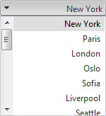

# RTL Support


## 

**RadComboBox** provides support for locales that read right-to-left. All you need do to achieve a RTL look and feel is mark the **RadComboBox** instance with **dir="rtl"**.

````ASPNET
<telerik:radcombobox 
	id="RadComboBox1" 
	runat="server" 
	height="140px" 
	skin="Default"
	width="150px" 
	contentfile="~/App_Data/combobox.xml" 
	showtoggleimage="True" 
	dir="rtl">
</telerik:radcombobox>
````


This definition results in the following appearance:



See and online demo of the RTL support at [Right-to-Left Support](https://demos.telerik.com/aspnet-ajax/ComboBox/Examples/Functionality/Rtl/DefaultCS.aspx).
