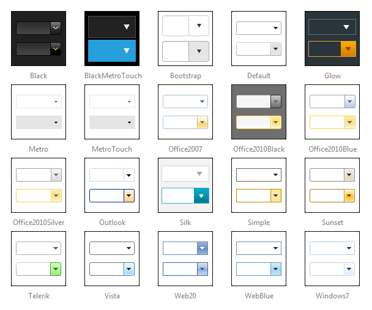

# Skins


To make customizing the appearance of **RadComboBox** as easy as possible, the control uses **skins.** A skin is a set of images and a CSS stylesheet that can be applied to RadComboBox elements (items, images, etc.) and defines their look and feel. To apply a skin to RadComboBox, set its **Skin** property, either using the properties pane or the **RadComboBox**[ Smart Tag ]().

The control comes with a number of built-in skins:




## Customizing Skins

You can tweak the existing skins, or create your own. Each skin has two main elements: images and a stylesheet. When creating your own, it is a good idea to start with the stylesheet of an existing skin and alter that. See the [Tutorial: Creating a Custom Skin]() topic for a step-by-step walk through. To use your own skin

1. Add the new CSS file to your project.

2. Drag and drop the CSS file from the Project Explorer onto your Web page.

3. Set the **EnableEmbeddedSkins** property of **RadComboBox** to **False**.

The stylesheet for a **RadComboBox** skin has the name **ComboBox.[SkinName].css** and can be found in the **...Skins/[SkinName]** directory. The images are found in the **...Skins/[SkinName]/ComboBox** directory. For example, the stylesheet for the "Black" skin is called ComboBox.Black.css and is located in the ...Skins/Black directory.The images are found in the ...Skins/Black/ComboBox directory. The images are referenced by name from within the stylesheet.

For more information on the CSS File structure, see the [Understanding the Skin CSS File]() topic.

The stylesheet for the "Black" skin is as follows:

````ASPNET
/* RadComboBox Black skin */

/*global*/

.RadComboBox_Black,
.RadComboBox_Black .rcbInput,
.RadComboBoxDropDown_Black
{
	font: 12px "Segoe UI", Arial, sans-serif;
	color: #fff;
}

/* combobox */

.RadComboBox_Black .rcbInputCellLeft,
.RadComboBox_Black .rcbInputCellRight,
.RadComboBox_Black .rcbArrowCellLeft,
.RadComboBox_Black .rcbArrowCellRight
{
	background-image: url('ComboBox/rcbSprite.png');
	_background-image: url('ComboBox/rcbSpriteIE6.png');
}

.RadComboBox_Black td.rcbInputCellLeft { background-position: 0 -154px; }
.RadComboBox_Black td.rcbInputCellRight { background-position: 100% -154px; }

.RadComboBox_Black .rcbHovered td.rcbInputCellLeft { background-position: 0 -154px; }
.RadComboBox_Black .rcbHovered td.rcbInputCellRight { background-position: 100% -154px; }

.RadComboBox_Black .rcbFocused td.rcbInputCellLeft { background-position: 0 -154px; }
.RadComboBox_Black .rcbFocused td.rcbInputCellRight { background-position: 100% -154px; }

.RadComboBox_Black .rcbReadOnly .rcbInputCellLeft { background-position: 0 0; }
.RadComboBox_Black .rcbReadOnly .rcbInputCellRight { background-position: 100% 0; }

.RadComboBox_Black .rcbHovered .rcbReadOnly td.rcbInputCellLeft { background-position: 0 -22px; }
.RadComboBox_Black .rcbHovered .rcbReadOnly td.rcbInputCellRight { background-position: 100% -22px; }

.RadComboBox_Black .rcbFocused .rcbReadOnly td.rcbInputCellLeft { background-position: 0 -44px; }
.RadComboBox_Black .rcbFocused .rcbReadOnly td.rcbInputCellRight { background-position: 100% -44px; }

.RadComboBox_Black .rcbInputCell .rcbEmptyMessage
{
	color: #ccc;
}

.RadComboBox_Black .rcbHovered .rcbInputCell .rcbInput
{
	color: #9eda29;
}

.RadComboBox_Black .rcbDisabled .rcbInputCell .rcbInput
{
	color: #6f6f6f;
}

.RadComboBox_Black td.rcbArrowCellLeft { background-position: -18px -88px; }
.RadComboBox_Black td.rcbArrowCellRight { background-position: 0 -88px; }

.RadComboBox_Black .rcbHovered .rcbArrowCellLeft { background-position: -54px -88px; }
.RadComboBox_Black .rcbHovered .rcbArrowCellRight { background-position: -36px -88px; }

.RadComboBox_Black .rcbFocused .rcbArrowCellLeft { background-position: -90px -88px; }
.RadComboBox_Black .rcbFocused .rcbArrowCellRight { background-position: -72px -88px; }

.RadComboBox_Black td.rcbArrowCellHidden,
.RadComboBox_Black .rcbHovered td.rcbArrowCellHidden,
.RadComboBox_Black .rcbFocused td.rcbArrowCellHidden { background-position: 100% -154px; }

.RadComboBox_Black_rtl td.rcbArrowCellHidden,
.RadComboBox_Black_rtl .rcbHovered td.rcbArrowCellHidden,
.RadComboBox_Black_rtl .rcbFocused td.rcbArrowCellHidden { background-position: 0 -154px; }

/* Read-only styles */

.RadComboBox_Black .rcbReadOnly td.rcbArrowCellLeft { background-position: -18px -88px; }
.RadComboBox_Black .rcbReadOnly td.rcbArrowCellRight { background-position: -2px -88px; }

.RadComboBox_Black .rcbHovered .rcbReadOnly .rcbArrowCellLeft { background-position: -54px -88px; }
.RadComboBox_Black .rcbHovered .rcbReadOnly .rcbArrowCellRight { background-position: -38px -88px; }

.RadComboBox_Black .rcbFocused .rcbReadOnly .rcbArrowCellLeft { background-position: -90px -88px; }
.RadComboBox_Black .rcbFocused .rcbReadOnly .rcbArrowCellRight { background-position: -74px -88px; }

.RadComboBox_Black .rcbReadOnly td.rcbArrowCellHidden { background-position: -15px -88px; }
.RadComboBox_Black .rcbHovered .rcbReadOnly td.rcbArrowCellHidden { background-position: -51px -88px; }
.RadComboBox_Black .rcbFocused .rcbReadOnly td.rcbArrowCellHidden { background-position: -87px -88px; }

.RadComboBox_Black_rtl .rcbReadOnly td.rcbArrowCellHidden { background-position: -18px -88px; }
.RadComboBox_Black_rtl .rcbHovered .rcbReadOnly td.rcbArrowCellHidden { background-position: -54px -88px; }
.RadComboBox_Black_rtl .rcbFocused .rcbReadOnly td.rcbArrowCellHidden { background-position: -90px -88px; }

/* dropdown */

.RadComboBoxDropDown_Black .rcbHeader,
.RadComboBoxDropDown_Black .rcbFooter,
.RadComboBoxDropDown_Black .rcbMoreResults,
.RadComboBoxDropDown_Black .rcbMoreResults a
{
	background-image: url('ComboBox/rcbSprite.png');
	_background-image: url('ComboBox/rcbSpriteIE6.png');
}

.RadComboBoxDropDown_Black
{
	background: #464646;
	border-color: #080808;
	color: #d7d7d7;
}

.RadComboBoxDropDown_Black .rcbHeader,
.RadComboBoxDropDown_Black .rcbFooter
{
	background-color: #f1f2f4;
	background-position: 0 -110px;
}

.RadComboBoxDropDown_Black .rcbHeader
{
	border-bottom-color: #1a1a1a;
}

.RadComboBoxDropDown_Black .rcbFooter
{
	border-top-color: #1a1a1a;
}

.RadComboBoxDropDown_Black .rcbItem em
{
	background: #222;
}

.RadComboBoxDropDown_Black .rcbHovered
{
	background: #2e2e2e;
	color: #9eda29;
}

.RadComboBoxDropDown_Black .rcbCheckAllItems,
.RadComboBoxDropDown_Black .rcbCheckAllItemsHovered {
	color: #ffffff;
	background-color: #2e2e2e;
	background-position: 0 -20px;
}
.RadComboBoxDropDown_Black .rcbCheckAllItemsHovered {
	color: #9eda29;
	background-position: 0 -20px;
}

.RadComboBoxDropDown_Black .rcbSeparator
{
	background: #2e2e2e;
	color: #fff;
}

.RadComboBox_Black .rcbDisabled .rcbInputCell .rcbInput,
.RadComboBoxDropDown_Black .rcbDisabled
{
	color: #999;
}

.RadComboBox_Black .rcbDisabled td.rcbInputCellLeft { background-position: 0 -66px; }
.RadComboBox_Black .rcbDisabled td.rcbInputCellRight { background-position: 100% -66px; }
.RadComboBox_Black .rcbDisabled td.rcbArrowCellLeft { background-position: -126px -88px; }
.RadComboBox_Black .rcbDisabled td.rcbArrowCellRight { background-position: -108px -88px; }
.RadComboBox_Black .rcbDisabled .rcbReadOnly td.rcbArrowCellRight { background-position: -110px -88px; }
.RadComboBox_Black table.rcbDisabled td.rcbArrowCellHidden,
.RadComboBox_Black .rcbDisabled .rcbReadOnly td.rcbArrowCellHidden { background-position: -123px -88px; }
.RadComboBox_Black_rtl table.rcbDisabled td.rcbArrowCellHidden,
.RadComboBox_Black_rtl .rcbDisabled .rcbReadOnly td.rcbArrowCellHidden { background-position: 0 -66px; }

.RadComboBoxDropDown_Black .rcbLoading
{
	background: #f0f0f0;
}

.RadComboBoxDropDown_Black .rcbMoreResults
{
	border-top-color: #3a3a3a;
	background-position: 0 -132px;
	background-color: #454545;
	color: #fff;
}

.RadComboBoxDropDown_Black .rcbMoreResults a
{
	background-position: -157px -94px;
}
````


# See Also

 * [Controlling Appearance]()

 * [Overview]()

 * [Tutorial: Creating a Custom Skin]()

 * [Understanding the Skin CSS File]()

 * [Understanding the Skin CSS File]()
